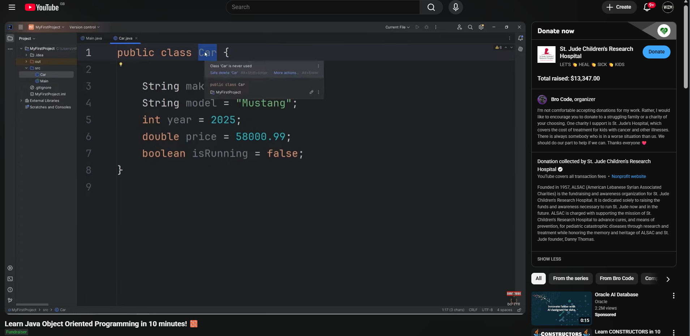
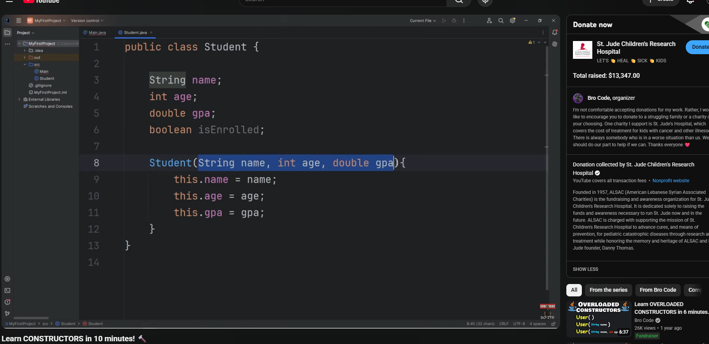
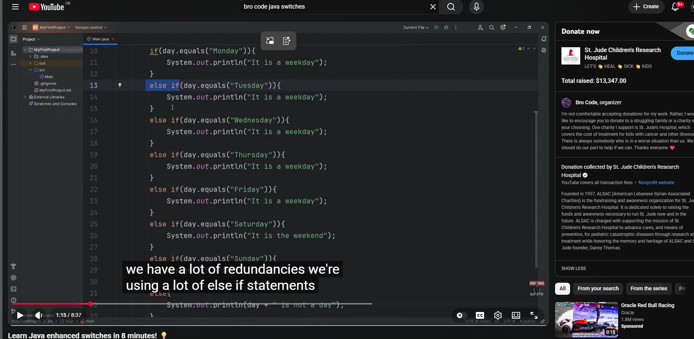

| Module Code           | IY4113                                             |
| --------------------- |:-------------------------------------------------- |
| Group                 | A                                                  |
| Module Title          | Practical assignment<br> part 1: Java Fundamentals |
| Assessment<br> Type   | Report                                             |
| Module Tutor<br> Name | Jonathan Shore                                     |
| Student ID<br> Number | P495305                                            |
| Assessment<br> Window | Final submission:<br>24/05/2026- 31/05/2026        |

- [x] *I confirm that this assignment is my own work. Where I have referred to academic sources, I have provided in-text citations and included the sources in
  the final reference list.*

- [x] *Where I have used AI, I have cited and referenced appropriately.

# Introduction

For this assignment, I was tasked with creating a console-based
application written in Java called CityRide Lite. The application serves to
help users log public transport journeys they have made in a day. The
application allows users to enter journey details including the date, start and
destination zones, the type of passenger and whether the journey was made on
peak or off-peak hours. Using a given dataset, the program will calculate
appropriate fare, apply any discounts applicable to passengers and enforce
daily fare limits. In developing the solution, object-oriented programming
techniques were employed for use within the Java platform. This was achieved
through creating multiple classes responsible for the different tasks such as
journey management, validation of input, fare calculations, generation of daily
summaries and storage of journeys in memory for the session. A number of
functions have been implemented within this solution, these include adding
journeys, viewing saved journeys, sorting journeys according to certain
criteria, deletion of journey details, resetting of the application and daily
summary reports. Validation is incorporated to reject any invalid data, which
might be entered by the user such as incorrect zones and passenger types. The
entire process was carried out systematically, through phases of analysis,
design, implementation, testing, and evaluation. In the analysis phase, the
specifications of the program were determined and decomposed into separate
functions. The flow charts and class diagrams were used for designing the
program. The implementation phase involved creating the program in Java
programming language, where classes, constructor, encapsulation, getters and
setters were some of the concepts used. Testing phase ensured that the designed
solution works effectively as per its specified function. This report
highlights the process of analysis, design, implementation, testing and
evaluation carried out in order to meet the requirements of the assignment.

# Analysis

**Core program functions**

- Ask for journey details

- Take information such as starting zone,
   destination zone, time band and passenger type

- Calculate final fare

- Analyse how many zones crossed, correct base
   fare and apply discounts if applicable and check if daily cap reached
   before calculating

- Memory

- The program must be able to store all the
   journeys entered during that session in the memory so the user may go
   over them at a later time or filter within a certain criteria or remove
   if required

- Journey information

- The application should be able to provide
   summaries like the total journeys, total spend, the average cost and
   their most expensive journey

**System limitations and rules**

**Console UI**: The program is strictly console based

**No persistence**: Records only single
day sessions and calculates everything in its own memory only so no files are
required and only exists during that instance of program

**Zones**: Only 5 zones, central, inner, outer,
suburban, rural

**Time bands**: 2 time bands, Peak and Off peak

**Passenger types**: There are 4 types,
adult, student, senior and child

**Fare rules**: Uses supplied city ride dataset

**Zones crossed formula**: abs(tozone - fromzone) + 1

## IPO Table


# Algorithm Design

## Class Diagram


## Main


## Add Journey Flowchart


## List Journey Flowchart


## Remove Journeys Flowchart


## Reset Journeys Flowchart


## Daily Summary Flowchart


# Testing

| Test No | Testing item                              | Test Description            | Expected Result                                      | Actual Result                                  | Comments                                      |
|:-------:| ----------------------------------------- | --------------------------- | ---------------------------------------------------- | ---------------------------------------------- | --------------------------------------------- |
| 1       | int choice = input.nextInt();             | Valid data (1)              | System should lead user to Add Journey process       | System leads user to Add Journey process       | No comment                                    |
| 2       | int choice = input.nextInt();             | Extreme data (50)           | System should tell user to pick a valid menu option  | System displays invalid choice message         | No comment                                    |
| 3       | int choice = input.nextInt();             | Invalid data (-50)          | System should tell user to pick a valid menu option  | System displays invalid choice message         | No comment                                    |
| 4       | int choice = input.nextInt();             | Invalid data type ("ABC")   | System should reject input and request integer value | Program terminates with InputMismatchException | Data type validation not implemented          |
| 5       | String date = input.nextLine();           | Valid data (25/05/2026)     | Date should be accepted                              | Date accepted                                  | No comment                                    |
| 6       | String date = input.nextLine();           | Invalid format (2026-05-25) | System should reject date                            | Date accepted                                  | Date format validation not implemented (FAIL) |
| 7       | String date = input.nextLine();           | Blank input ("")            | System should reject date                            | System displays Invalid Date                   | No comment                                    |
| 8       | String date = input.nextLine();           | Invalid value ("ABC")       | System should reject date                            | Date accepted                                  | Date format validation not implemented (FAIL) |
| 9       | int fromZone = input.nextInt();           | Valid data (3)              | Zone should be accepted                              | Zone accepted                                  | No comment                                    |
| 10      | int fromZone = input.nextInt();           | Extreme data (6)            | System should reject zone                            | System displays Invalid Zone                   | No comment                                    |
| 11      | int fromZone = input.nextInt();           | Invalid data (-1)           | System should reject zone                            | System displays Invalid Zone                   | No comment                                    |
| 12      | int fromZone = input.nextInt();           | Invalid data type ("ABC")   | System should reject input and request integer value | Program terminates with InputMismatchException | Data type validation not implemented (FAIL)   |
| 13      | int toZone = input.nextInt();             | Valid data (5)              | Zone should be accepted                              | Zone accepted                                  | No comment                                    |
| 14      | int toZone = input.nextInt();             | Extreme data (10)           | System should reject zone                            | System displays Invalid Zone                   | No comment                                    |
| 15      | int toZone = input.nextInt();             | Invalid data (-1)           | System should reject zone                            | System displays Invalid Zone                   | No comment                                    |
| 16      | int toZone = input.nextInt();             | Invalid data type ("ABC")   | System should reject input and request integer value | Program terminates with InputMismatchException | Data type validation not implemented (FAIL)   |
| 17      | String passengerInput = input.nextLine(); | Valid data (ADULT)          | Passenger type should be accepted                    | Passenger type accepted                        | No comment                                    |
| 18      | String passengerInput = input.nextLine(); | Invalid value (TEACHER)     | System should reject passenger type                  | System displays Invalid Passenger Type         | No comment                                    |
| 19      | String passengerInput = input.nextLine(); | Blank input ("")            | System should reject passenger type                  | System displays Invalid Passenger Type         | No comment                                    |
| 20      | String passengerInput = input.nextLine(); | Invalid format (adult123)   | System should reject passenger type                  | System displays Invalid Passenger Type         | No comment                                    |
| 21      | String timeBandInput = input.nextLine();  | Valid data (PEAK)           | Time band should be accepted                         | Time band accepted                             | No comment                                    |
| 22      | String timeBandInput = input.nextLine();  | Invalid value (MIDDAY)      | System should reject time band                       | System displays Invalid Time Band              | No comment                                    |
| 23      | String timeBandInput = input.nextLine();  | Blank input ("")            | System should reject time band                       | System displays Invalid Time Band              | No comment                                    |
| 24      | String timeBandInput = input.nextLine();  | Invalid format (peak123)    | System should reject time band                       | System displays Invalid Time Band              | No comment                                    |
| 25      | int choice = input.nextInt();             | Valid data (1)              | System should display all journeys                   | Journeys displayed                             | No comment                                    |
| 26      | int choice = input.nextInt();             | Extreme data (50)           | System should display invalid choice message         | System displays invalid choice message         | No comment                                    |
| 27      | int choice = input.nextInt();             | Invalid data (-50)          | System should display invalid choice message         | System displays invalid choice message         | No comment                                    |
| 28      | int choice = input.nextInt();             | Invalid data type ("ABC")   | System should reject input and request integer value | Program terminates with InputMismatchException | Data type validation not implemented (FAIL)   |
| 29      | String filter = input.nextLine();         | Valid data (STUDENT)        | Matching journeys should be displayed                | Matching journeys displayed                    | No comment                                    |
| 30      | String filter = input.nextLine();         | Invalid value (VIP)         | No matching journeys should be found                 | No matching journeys found                     | No comment                                    |
| 31      | String filter = input.nextLine();         | Blank input ("")            | No matching journeys should be found                 | No matching journeys found                     | No comment                                    |
| 32      | String filter = input.nextLine();         | Invalid format (student123) | No matching journeys should be found                 | No matching journeys found                     | No comment                                    |
| 33      | String filter = input.nextLine();         | Valid data (PEAK)           | Matching journeys should be displayed                | Matching journeys displayed                    | No comment                                    |
| 34      | String filter = input.nextLine();         | Invalid value (MORNING)     | No matching journeys should be found                 | No matching journeys found                     | No comment                                    |
| 35      | String filter = input.nextLine();         | Blank input ("")            | No matching journeys should be found                 | No matching journeys found                     | No comment                                    |
| 36      | String filter = input.nextLine();         | Invalid format (peak123)    | No matching journeys should be found                 | No matching journeys found                     | No comment                                    |
| 37      | int zone = input.nextInt();               | Valid data (3)              | Matching journeys should be displayed                | Matching journeys displayed                    | No comment                                    |
| 38      | int zone = input.nextInt();               | Extreme data (10)           | No matching journeys should be found                 | No matching journeys found                     | No comment                                    |
| 39      | int zone = input.nextInt();               | Invalid data (-1)           | No matching journeys should be found                 | No matching journeys found                     | No comment                                    |
| 40      | int zone = input.nextInt();               | Invalid data type ("ABC")   | System should reject input and request integer value | Program terminates with InputMismatchException | Data type validation not implemented (FAIL)   |
| 41      | String date = input.nextLine();           | Valid data (25/05/2026)     | Matching journeys should be displayed                | Matching journeys displayed                    | No comment                                    |
| 42      | String date = input.nextLine();           | Invalid format (2026-05-25) | No matching journeys should be found                 | No matching journeys found                     | No comment                                    |
| 43      | String date = input.nextLine();           | Blank input ("")            | No matching journeys should be found                 | No matching journeys found                     | No comment                                    |
| 44      | String date = input.nextLine();           | Invalid value ("ABC")       | No matching journeys should be found                 | No matching journeys found                     | No comment                                    |
| 45      | int id = input.nextInt();                 | Valid data (Existing ID 1)  | Journey should be removed                            | Journey removed successfully                   | No comment                                    |
| 46      | int id = input.nextInt();                 | Extreme data (999)          | System should indicate journey not found             | System indicates journey not found             | No comment                                    |
| 47      | int id = input.nextInt();                 | Invalid data (-1)           | System should indicate journey not found             | System indicates journey not found             | No comment                                    |
| 48      | int id = input.nextInt();                 | Invalid data type ("ABC")   | System should reject input and request integer value | Program terminates with InputMismatchException | Data type validation not implemented (FAIL)   |

# Evaluation

In general, this CityRide Lite program fulfills the majority of the requirements defined in the assignment description. Users can make new journeys, calculate the fare based on the provided database, give discounts for passengers, set daily fare caps, view the list of added journeys, filter journeys according to specified criteria, delete journeys, reset the session, and create summary reports. The program uses object-oriented programming in the development process with various classes used to implement certain functions of the program.

Nevertheless, there are still certain areas in which improvements can be made. According to the sheet, all invalid user input must be processed and re-entered until the proper value is entered. Invalid user values usually lead to the appearance of an error message followed by the transition to the main menu. Besides that, at the moment, the program cannot cope with handling exceptions in the form of the InputMismatchException error. For example, when the user enters text instead of an integer number, the application terminates unexpectedly.

## Strengths

1. Proper use of OOP

One significant strength of the program is the implementation of OOP principle. Responsibility for different tasks in the program has been distributed among various classes such as Journey, JourneyManager, FareCalculator, Validation and SummaryManager. This increases the comprehensibility and scalability of the program.

2. Efficient use of dataset

The dataset provided as part of the assignment has been incorporated effectively in the program. The calculation of fares, discount to passengers, zone validation and fare cap for each day are carried out based on the data available in the dataset rather than being hard-coded in the program code.

3. Comprehensive functionality

Various functionalities provided in the application include add journey, view journey, filter by passenger type, time band, zone and date, generate summaries and delete journey. All these functionalities provide the comprehensive application specified in the requirements.

## Weaknesses

1. Lack of exception handling for invalid data types

The main shortcoming of the code is the absence of exception handling for invalid data types. When trying to enter any text like "toy" where an integer is supposed to be entered, the application terminates due to the InputMismatchException. This error affect the seamless work of the application.

2. Poor date validation

Date validation is currently performed on the absence of any inputs. Therefore, even invalid strings like "jay" might be used in the application without any restrictions. It can lead to poor quality data storage.

3. No prompting users to re-enter data

According to the task sheet, an application should prompt users to re-enter data after receiving invalid ones. However, the current version prompts the user to go back to a menu and re-enter their choice if some input was incorrect. While it is good because it excludes any wrong values, to be honest, I don't believe it properly completes the task.

## Areas for Improvement

1. Exception handling

The program can be modified to incorporate more try-catch statements surrounding scanner input operations. The program will avoid any possible crash in case of invalid data type being provided by the user and permit the users to proceed with using the software after providing invalid input data. This improvement will greatly enhance the level of reliability and professionalism of the program.

2. Enhanced input validation

The validation mechanism can be improved to include date format validation and ask for correct input several times until valid input is provided. The improved validation will lead to higher-quality data input and will make the software usage more convenient.

## Conclusion

The final version of the program meets the main purpose of creating a program which serves as a companion app that can be used for storing information on public transport travels. All the main requirements have been fulfilled, and the program shows good structure and efficient implementation of OOP techniques. There are some minor issues concerning input validation and exception handling; however, the solution is generally satisfactory.

# Code Listing

### Main

import java.util.Scanner;  

public class Main {  
    static Scanner input = new Scanner(System.in);  
    static JourneyManager manager = new JourneyManager(input);  
    public static void main(String[] args) {  

int choice;  
do {  

    displayMenu();  
    choice = getUserChoice();  
    
    switch (choice) {  
    
        <mark>// (Bro Code, 2024) </mark> 
    
        <mark>case 1:</mark>  
            manager.addJourney();  
            break;  
    
        <mark>case 2</mark>:  
            manager.viewJourneysMenu();  
            break;  
        <mark>case 3:</mark>  
            manager.viewDailySummary();  
            break;  
    
        <mark>case 4</mark>:  
            manager.removeJourney();  
            break;  
    
        <mark>case 5: </mark> 
            manager.resetJourneys();  
            break;  
    
        <mark>case 6:</mark>  
            System.out.println("Program closed");  
            break;  
    
      <mark>  default</mark>:  
            System.out.println("\nInvalid choice");  
    
    }  

} while (choice != 6);  

}  
public static void displayMenu() {  

System.out.println("CityRide Lite\n");  

System.out.println("1. Add Journey");  
System.out.println("2. View Journeys");  
System.out.println("3. Daily summary");  
System.out.println("4. Remove Journey");  
System.out.println("5. Reset Day");  
System.out.println("6. Exit");  

}  
public static int getUserChoice() {  

System.out.print("Enter Choice: ");  
int choice = input.nextInt();  
input.nextLine();  

return choice;  

}  

}

## Journey

import java.math.BigDecimal;  

public class Journey {  
    private int journeyID;  
    private String date;  
    private int fromZone;  
    private int toZone;  
    private CityRideDataset.PassengerType passengerType;  
    private CityRideDataset.TimeBand timeBand;  
    private BigDecimal baseFare;  
    private BigDecimal finalFare;  

// Constructor  
public Journey(int journeyID, String date, int fromZone, int toZone, CityRideDataset.PassengerType passengerType,  
               CityRideDataset.TimeBand timeBand, BigDecimal baseFare, BigDecimal finalFare)  
{  

this.journeyID = journeyID;  
this.date = date;  
this.fromZone = fromZone;  
this.toZone = toZone;  
this.passengerType = passengerType;  
this.timeBand = timeBand;  
this.baseFare = baseFare;  
this.finalFare = finalFare;  

}  

// Get methods  
public int getJourneyID() {  
    return journeyID;  
}  
public String getDate() {  
    return date;  
}  
public int getFromZone() {  
    return fromZone;  
}  
public int getToZone() {  
    return toZone;  
}  
public CityRideDataset.PassengerType getPassengerType() {  
    return passengerType;  
}  
public CityRideDataset.TimeBand getTimeBand() {  
    return timeBand;  
}  
public BigDecimal getBaseFare() {  
    return baseFare;  
}  
public BigDecimal getFinalFare() {  
    return finalFare;  
}  

// Set methods  
public void setJourneyID(int journeyID) {  
    this.journeyID = journeyID;  
}  
public void setDate(String date) {  
    this.date = date;  
}  
public void setFromZone(int fromZone) {  
    this.fromZone = fromZone;  
}  
public void setToZone(int toZone) {  
    this.toZone = toZone;  
}  
public void setPassengerType(CityRideDataset.PassengerType passengerType) {  
    this.passengerType = passengerType;  
}  
public void setTimeBand(CityRideDataset.TimeBand timeBand) {  
    this.timeBand = timeBand;  
}  
public void setBaseFare(BigDecimal baseFare) {  
    this.baseFare = baseFare;  
}  
public void setFinalFare(BigDecimal finalFare) {  
    this.finalFare = finalFare;  
}  

// Methods  
public int calculateZonesCrossed() {  
    return Math.abs(fromZone - toZone) + 1;  

}  
public void displayJourney() {  
    System.out.println("\nJourney ID: " + journeyID);  
    System.out.println("Date: " + date);  
    System.out.println("From Zone: " + fromZone);  
    System.out.println("To Zone: " + toZone);  
    System.out.println("Passenger Type: " + passengerType);  
    System.out.println("Time Band: " + timeBand);  
    System.out.println("Base Fare: " + baseFare);  
    System.out.println("Final Fare: " + finalFare);  
}  

}

## Journey Manager

import java.util.ArrayList;  
import java.util.Scanner;  
import java.math.BigDecimal;  

public class JourneyManager{  

private ArrayList<Journey> journeys;  
private Scanner input;  
private Validation validation;  
private FareCalculator calculator;  
private SummaryManager summaryManager;  
private int nextJourneyID;  

// Constructor  
public JourneyManager(Scanner input) {  

journeys = new ArrayList<>();  
validation = new Validation();  
this.input = input;  
calculator = new FareCalculator();  
summaryManager = new SummaryManager();  
nextJourneyID = 1;  

}  

public void addJourney() {  
    System.out.println("\nAdd Journey");  

// Date  
System.out.print("Enter Date: ");  
String date = input.nextLine();  

// Validate Date  
if (!validation.validateDate(date)) {  

    System.out.println("Invalid Date");  
    
    return;  

}  

// Zones  
System.out.print("Enter From Zone: ");  
int fromZone = input.nextInt();  

System.out.print("Enter To Zone: ");  
int toZone = input.nextInt();  

// Validate Zones  
if (!validation.validateZone(fromZone) || !validation.validateZone(toZone)) {  

    System.out.println("Invalid Zone");  
    
    return;  

}  

input.nextLine();  

// Passenger Type  
System.out.print("Passenger Type (ADULT/STUDENT/CHILD/SENIOR_CITIZEN): ");  

String passengerInput =  
        input.nextLine().toUpperCase();  

// Validate Passenger Type  
if (!validation.validatePassengerType(passengerInput)) {  

    System.out.println("Invalid Passenger Type");  
    
    return;  

}  
// Time Band  
System.out.print(  
        "Time Band (PEAK/OFF_PEAK): "  
);  

String bandInput =  
        input.nextLine().toUpperCase();  

// Validate Time Band  
if (!validation.validateTimeBand(bandInput)) {  

    System.out.println("Invalid Time Band");  
    
    return;  

}  

// Convert To Enums  

   <mark> // (Oracle, 2026)</mark>

CityRideDataset.PassengerType passengerType = <mark>CityRideDataset.PassengerType.valueOf(passengerInput);</mark>  
    CityRideDataset.TimeBand timeBand = <mark>CityRideDataset.TimeBand.valueOf(bandInput); </mark> 

// Fare  
BigDecimal baseFare = calculator.calculateBaseFare(fromZone, toZone, timeBand);  
BigDecimal finalFare = calculator.applyDiscount(baseFare, passengerType);  

// Daily cap  
BigDecimal totalSpentToday = BigDecimal.ZERO;  

for (Journey existingJourney : journeys) {  
    if (existingJourney.getDate().equals(date) && existingJourney.getPassengerType() == passengerType) {  

        <mark>// (In28Minutes, 2018)</mark>  
        <mark>totalSpentToday = totalSpentToday.add(existingJourney.getFinalFare()); </mark> 

</mark>
        }  
    }  
    finalFare = calculator.applyDailyCap(totalSpentToday, finalFare, passengerType);

// Create Journey  
Journey journey = new Journey(nextJourneyID, date, fromZone, toZone, passengerType, timeBand, baseFare, finalFare);  
// Store Journey  

   <mark> // (Oracle, 2026)  </mark>    

 <mark> journeys.add(journey)</mark>;  

nextJourneyID++;  

System.out.println("\nJourney Added Successfully");  

}  

public void listJourneys() {  
    if (journeys.isEmpty()) {  
        System.out.println("\nNo Journeys Stored");  

    return;  

}  

for (Journey journey : journeys) {  
    journey.displayJourney();  
}  

}  

public void filterByPassengerType() {  
    input.nextLine();  
    System.out.print("\nEnter Passenger Type To Filter: ");  

String filter = input.nextLine().toUpperCase();  

boolean found = false;  

for (Journey journey : journeys) {  

   <mark> // (Alexandra Obregon, 2024)</mark>  
    if <mark>(journey.getPassengerType().name().equals(filter)) {journey.displayJourney()</mark>;  

        found = true;  
    }  

}  
if (!found) {  

    System.out.println(  
            "\nNo Matching Journeys Found"  
    );  

}  

}  

public void filterByTimeBand() {  

input.nextLine();  
System.out.print("\nEnter Time Band (PEAK/OFF_PEAK): ");  

String filter = input.nextLine().toUpperCase();  

boolean found = false;  

for (Journey journey : journeys) {  

    if (journey.getTimeBand().name().equals(filter)) {  
        journey.displayJourney();  
        found = true;  
    }  

}  
if (!found) {  

    System.out.println("\nNo Matching Journeys Found");  

}  

}  

public void filterByZone() {  

System.out.print("\nEnter Zone: ");  
int zone = input.nextInt();  
boolean found = false;  

for (Journey journey : journeys) {  

    if (journey.getFromZone() == zone || journey.getToZone() == zone) {  
        journey.displayJourney();  
        found = true;  
    }  

}  

if (!found) {  
    System.out.println("\nNo Matching Journeys Found");  
}  

}  

public void filterByDate() {  

input.nextLine();  
System.out.print("\nEnter Date: ");  
String date = input.nextLine();  
boolean found = false;  

for (Journey journey : journeys) {  
    if (journey.getDate().equals(date)) {  

        journey.displayJourney();  
        found = true;  
    }  

}  

if (!found) {  
    System.out.println("\nNo Matching Journeys Found");  
}  

}  

public void removeJourney() {  
    System.out.print("\nEnter Journey ID To Remove: ");  

int id = input.nextInt();  

boolean removed = false;  

for (int i = 0; i < journeys.size(); i++) {  

    if (journeys.get(i).getJourneyID() == id) {  
    
        journeys.remove(i);  
    
        removed = true;  
    
        System.out.println("\nJourney Removed");  
    
        break;  
    
    }  

}  

if (!removed) {  

    System.out.println("\nJourney ID Not Found");  

}  

}  

public void resetJourneys() {  
    journeys.clear();  

System.out.println("\nAll Journeys Reset");  

}  

public void viewDailySummary() {  

summaryManager.calculateDailySummary(journeys);  

}  

public void viewJourneysMenu() {  

int choice;  

do {  

    System.out.println("\nView Journeys");  
    
    System.out.println("1. View All Journeys");  
    
    System.out.println("2. Filter By Passenger Type");  
    
    System.out.println("3. Filter By Time Band");  
    
    System.out.println("4. Filter By Zone");  
    
    System.out.println("5. Filter By Date");  
    
    System.out.println("6. Passenger Totals");  
    
    System.out.println("7. Journey categories");  
    
    System.out.println("8. Return");  
    
    System.out.print("Enter Choice: ");  
    
    choice = input.nextInt();  

  <mark>  // (Bro Code, 2024) </mark> 

    switch (choice) {  
    
       <mark> case 1</mark>:  
            listJourneys();  
            break;  
    
        <mark>case 2: </mark> 
            filterByPassengerType();  
            break;  
    
        <mark>case 3:</mark>  
            filterByTimeBand();  
            break;  
    
       <mark> case 4: </mark> 
            filterByZone();  
            break;  
    
        <mark>case 5: </mark> 
            filterByDate();  
            break;  
    
        <mark>case 6</mark>:  
            summaryManager.calculateTotalsByPassengerType(journeys);  
            break;  
    
        <mark>case 7:</mark>  
            summaryManager.countJourneyCategories(journeys);  
            break;  
    
    }  

} while (choice != 8);  

}  

}

## Fare Calculator

import java.math.BigDecimal;  
import java.math.RoundingMode;  

public class FareCalculator {  

// Constructor  
public FareCalculator() {}  

// Calculate Base Fare  
// (In28Minutes, 2018)    public BigDecimal calculateBaseFare(int fromZone, int toZone, CityRideDataset.TimeBand timeBand) {  

return CityRideDataset.getBaseFare(fromZone, toZone, timeBand);  

}  

// Apply Discount  
<mark>// (In28Minutes, 2018) </mark>   public BigDecimal applyDiscount(BigDecimal baseFare, CityRideDataset.PassengerType passengerType) {  

BigDecimal discountRate = CityRideDataset.DISCOUNT_RATE.get(passengerType);  
BigDecimal discount = <mark>baseFare.multiply(discountRate)</mark>;  
BigDecimal finalFare =<mark> baseFare.subtract(discount);</mark>  

<mark>// (Oracle, 2026)  </mark>

   <mark> return finalFare.setScale(2, RoundingMode.HALF_UP </mark> 
    );  
}  

public BigDecimal applyDailyCap(BigDecimal totalSpentToday, BigDecimal currentFare,  
        CityRideDataset.PassengerType passengerType) {  

BigDecimal cap = CityRideDataset.DAILY_CAP.get(passengerType);  

<mark>// (Oracle, 2026)</mark>  

   <mark> BigDecimal newTotal = totalSpentToday.add(currentFare);  
</mark>
    if (newTotal.compareTo(cap) > 0) {  

   <mark> // (In28Minutes, 2018) </mark> 
    <mark>BigDecimal remaining = cap.subtract(totalSpentToday);</mark>  

 <mark>   if (remaining.compareTo(BigDecimal.ZERO) < 0) {  

</mark>
           <mark> return BigDecimal.ZERO;  
</mark>
        }

    return remaining;  

}  
return currentFare;  

}  

}

## Validation

public class Validation{  
    public Validation() {  
    }  
    // Validate Zone  
    public boolean validateZone(int zone) {  

return zone >= CityRideDataset.MIN_ZONE && zone <= CityRideDataset.MAX_ZONE;  

}  

<mark>// Validate Passenger Type</mark>  
<mark>// (Bro Code, 2024) </mark>   public boolean validatePassengerType(  
        String type  
) {  
   <mark> try </mark>{  
        CityRideDataset.PassengerType.valueOf(type);  
        return true;  

}  

   <mark> catch </mark>(IllegalArgumentException e) {  
        return false;  

}  

}  

// Validate Time Band  
<mark>// (Bro Code, 2024)</mark>    public boolean validateTimeBand(  
        String band  
) {  
   <mark> try {</mark>  
        CityRideDataset.TimeBand.valueOf(band);  
        return true;  
    }  

<mark>catch </mark>(IllegalArgumentException e) {  
    return false;  
}  

}  

// Validate Date  
public boolean validateDate(String date) {  
    return !date.isBlank();  

}  

}

## Summary Manager

import java.util.ArrayList;  
import java.math.BigDecimal;  
import java.math.RoundingMode;  

public class SummaryManager{  
    // Constructor  
    public SummaryManager() {}  

// Daily Summary  
public void calculateDailySummary(ArrayList<Journey> journeys) {  

if (journeys.isEmpty()) {  
    System.out.println("\nNo Journeys Stored");  
    return;  

}  

BigDecimal totalCharged =  
        BigDecimal.ZERO;  

Journey mostExpensive =  
        journeys.get(0);  

for (Journey journey : journeys) {  
    totalCharged = totalCharged.add(journey.getFinalFare());  

    if (journey.getFinalFare().compareTo(mostExpensive.getFinalFare()) > 0) {  
        mostExpensive = journey;  
    
    }  

}  

   <mark> // (In28Minutes, 2018)  </mark>

BigDecimal averageFare = totalCharged.divide(BigDecimal.valueOf(journeys.size()), 2, <mark>RoundingMode.HALF_UP);</mark>  

System.out.println(  
        "Daily Summary\n"  
);  

System.out.println("Total Journeys: " + journeys.size());  

System.out.println("Total Charged: " + totalCharged);  

System.out.println("Average Fare: " + averageFare);  

System.out.println("Most Expensive Journey ID: " + mostExpensive.getJourneyID());  

System.out.println("Most Expensive Fare:" + mostExpensive.getFinalFare());  

}  

// Passenger Totals  
public void calculateTotalsByPassengerType(ArrayList<Journey> journeys) {  

int adults = 0;  
int students = 0;  
int children = 0;  
int seniors = 0;  

for (Journey journey : journeys) {  

    switch (journey.getPassengerType()) {  
        case ADULT:  
            adults++;  
            break;  
    
        case STUDENT:  
            students++;  
            break;  
    
        case CHILD:  
            children++;  
            break;  
    
        case SENIOR_CITIZEN:  
            seniors++;  
            break;  
    
    }  

}  

System.out.println(  
        "Passenger Totals\n"  
);  

System.out.println("Adults: " + adults);  

System.out.println("Students: " + students);  

System.out.println("Children: " + children);  

System.out.println("Senior Citizens: " + seniors);  

}  

// Journey Categories  
public void countJourneyCategories(ArrayList<Journey> journeys) {  

int peak = 0;  
int offPeak = 0;  

for (Journey journey : journeys) {  

    if (journey.getTimeBand() == CityRideDataset.TimeBand.PEAK) {  
        peak++;  
    }  
    
    else {  
        offPeak++;  
    }  

}  

System.out.println("Journey Categories\n");  
System.out.println("Peak Journeys: " + peak);  
System.out.println("Off Peak Journeys: " + offPeak);  

}  

}

# References

- Oracle. (2014). *List (Java Platform SE 8)*. Retrieved from: [List (Java Platform SE 8 )](https://docs.oracle.com/javase/8/docs/api/java/util/List.html) [Accessed 31 May 2026].

- Oracle. (2014). *Enum (Java Platform SE 8)*. Retrieved from: [Enum (Java Platform SE 8 )](https://docs.oracle.com/javase/8/docs/api/java/lang/Enum.html) [Accessed 31 May 2026].

- Bro Code. (2024, December 9). *Learn EXCEPTION HANDLING in 8 minutes! ⚠️*. [YouTube video]. Retrieved from: [Learn EXCEPTION HANDLING in 8 minutes! ⚠️ - YouTube](https://www.youtube.com/watch?v=u1PROb-aRUI) [Accessed 22 May 2026].

- In28Minutes (2018, March 20). *Java BigDecimal Tutorial - 1*. [YouTube video]. Retrieved from: [Java BigDecimal Tutorial - 1 - YouTube](https://www.youtube.com/watch?v=MK6LDyQuv6U) [Accessed 23 May 2026].

- Oracle. (2014). *RoundingMode (Java Platform SE 8)*. Retrieved from: [RoundingMode (Java Platform SE 8 )](https://docs.oracle.com/javase/8/docs/api/java/math/RoundingMode.html) [Accessed 23 May 2026].

- Bro Code. (2024, December 5). *Learn Java enhanced switches in 8 minutes! 💡*. [YouTube video]. Retrieved from: [Learn Java enhanced switches in 8 minutes! 💡 - YouTube](https://www.youtube.com/watch?v=6q2JKiynteM&t=75s) [Accessed 18 May 2026].

- Obregon, A. (2024, September 1). Java's Objects.equals() Method Explained, *Medium*. [online] Retrieved from: https://medium.com/@AlexanderObregon/javas-objects-equals-method-explained-3a84c963edfa [Accessed 23 May 2026].

- Vertex42. (n.d.). *Simple Gantt Chart*. Retrieved from: [Simple Gantt Chart by Vertex42](https://www.vertex42.com/ExcelTemplates/simple-gantt-chart.html) [Accessed 02 May 2026].

# <mark>Appendices</mark>

# IY4113 Milestone 1

| Assessment Details | Please Complete All Details                                      |
| ------------------ | ---------------------------------------------------------------- |
| Group              | A                                                                |
| Module Title       | Applied Software Engineering using Object Orientated Programming |
| Assessment Type    | Java Fundamentals part 1                                         |
| Module Tutor Name  | Jonathan Shore                                                   |
| Student ID Number  | P495305                                                          |
| Date of Submission | 03/05/2026                                                       |
| Word Count         | 889                                                              |

- [x] *I confirm that this assignment is my own work. Where I have referred to academic sources, I have provided in-text citations and included the sources in
  the final reference list.*

- [x] *Where I have used AI, I have cited and referenced appropriately.

---

### Purpose of the Program

---

The aim and purpose of the program is to create a **console-based Java application** to help users keep track of their journeys using public transportation for a full day.

###### Core program functions

- Ask for journey details
  
  - Take information such as starting zone, destination zone, time band and passenger type

- Calculate final fare
  
  - Analyse how many zones crossed, correct base fare and apply discounts if applicable and check if daily cap reached before calculating

- Memory
  
  - The program must be able to store all the journeys entered during that session in the memory so the user may go over them at a later time or filter within a certain criteria or remove if required

- Journey information
  
  - The application should be able to provide summaries like the total journeys, total spend, the average cost and their most expensive journey

###### System limitations and rules

**Console UI**: The program is strictly console based

**No persistence**: Records only single day sessions and calculates everything in its own memory only so no files are required and only exists during that instance of program

**Zones**: Only 5 zones, central, inner, outer, suburban, rural

**Time bands**: 2 time bands, Peak and Off peak

**Passenger types**: There are 4 types, adult, student, senior and child

**Fare rules**: Uses supplied city ride dataset

**Zones crossed formula**: abs(tozone - fromzone) + 1

---

### Input Process Output Table

---


---

### Gantt Chart

---


---

### Diary Entries

---

#### Diary Entry 1 - 27/04/2026

Today I thoroughly read the assessment task information sheet trying to completely understand what I was required to submit in milestone 1, I began by reading section by section but after every section I would look back to the example submission that was given to us by out tutor and tried to find where he got each bit of information from.

Even though it wasn't the same task I was quickly able to figure out how to get my information and created a flexible timeline in my head for me to work through it. I began that same day on the first part about the purpose of the program.

I ensured I would every few lines flip back to the example sheet to keep a similar formatting. I did encounter one problem however I wasn't sure what to include in the constraints section as I didn't know where to find it, after a bit more reading I figure out it was taken from the scope and promptly finished for the day.

#### Diary Entry 2 - 29/04/2026

Today I started off by referring back to the example document, I noticed the IPO table was made in one table but a row for each function that had an input or output, I made the assumption that any task that only performs a process that does not directly require an input or an output will not be included in the table.

After that I read the assessment sheet and found out where to get my information from, I scanned the functional requirements breakdown section and found lots of functions scattered throughout, so I meticulously start writing each function down first line by line, then I started filling in the entire input column and then the output column and finally finished with the process column.

I struggled a bit with the process column as I wasn't sure how much to include but after going back and forth with the example sheet I found a good balance and finished.

#### Diary entry 3 - 02/05/2026

Today I planned was the last day I would need to work on this milestone, as usual I started off by reading the assessment sheet and example submission, the assessment didn't really help me as it was a timeline of my out progress and the example submission wasn't the best either.

I figured I had to tackle this one on my own, so I went back to the diary entries to get the dates, then I had to make the gantt chart, this part was pretty hard as I couldn't wrap my head around the formatting.

So this took an extra day as I had to read and watch videos about how to actually properly format it, but after I managed that the rest was easy as I just had to fill in dates.

In hindsight for next time it would be beneficial if I started earlier as I cut it quite close this time around.

Template used for the Gantt chart - [Simple Gantt Chart by Vertex42](https://www.vertex42.com/ExcelTemplates/simple-gantt-chart.html?utm_source=ms&utm_medium=file&utm_campaign=office&utm_content=text)

---

# IY4113 Milestone 2

| Assessment Details | Please Complete All Details                                      |
| ------------------ | ---------------------------------------------------------------- |
| Group              | A                                                                |
| Module Title       | Applied Software Engineering using Object Orientated Programming |
| Assessment Type    | Java Fundamentals part 1                                         |
| Module Tutor Name  | Jonathon Shore                                                   |
| Student ID Number  | P495305                                                          |
| Date of Submission | 10/ 05/2026                                                      |
| Word Count         | 938                                                              |

- [x] *I confirm that this assignment is my own work. Where I have referred to academic sources, I have provided in-text citations and included the sources in
  the final reference list.*
- [x] *Where I have used AI, I have cited and referenced appropriately.

---

### Algorithm Design

---

##### Class Diagram


##### Main Flowchart


##### Add Journey Flowchart


##### List Journey Flowchart


##### Remove Journey Flowchart


##### Reset Journeys Flowchart


##### Display summary Flowchart


---

### Research

---

#### Name of the program: OpenTripPlanner

Reference: [opentripplanner/OpenTripPlanner: An open source multi-modal trip planner](https://github.com/opentripplanner/OpenTripPlanner)

What it does well:

- It's able to efficiently organise the journey and transport data making it fast

- The code uses seperated components showing functional decomposition

- Provides journey planning capabilities

What it does poorly:

- Some of their features are heavily rely on external datasets and API's making it harder for beginners to run

Key design ideas I plan on re-using include:

- The seperation of logic into different modules

- The clean flow of data handling

Screenshot: 


#### Name of the program: Bus Reservation System

Reference: [Bus Reservation and Ticketing System In JAVA With Source Code - Source Code & Projects](https://code-projects.org/bus-reservation-and-ticketing-system-in-java-with-source-code/)

What it does well:

- The console structure is menu based so it runs indefinetly till user decides to quit.

- Billing and fare calculations are carried out very efficiently

- Stores both the journey and the passenger information

What it does poorly:

- The interface is incredibly basic

- Back-end can be made better as the program has to ask you how many passengers have a discount rather than than the program checking and applying it itself

Key ideas I plan on re-using:

- The menu based structure

- The efficient fare calculations

- Storing more variables of the journey to allow narrower filtering

Screenshot:


---

### Updated Gantt Chart

---


---

### Diary Entries

---

#### Diary Entry 1 - 05/05/2026

Today I kickstarted this milestone, I began by reading the template and reading the assessment sheet and realised I was in for a big one, multiple flowcharts was a huge step up from what I normally draw for algorithm design, nevertheless I started, I began by drawing the main flowchart pertaining to the beginning of the code this flowchart was quit simple to be honest, just a simple menu with a loop to keep it running till the user decides to quit with a validation system, nothing too bad. I then started the sub proccesses, the add journey flowchart was a bit long I went through multiple versions of this flowchart changing whether the program would validate the input after every input or after all inputs are taken in, in the end I settled for the latter for simplicity's sake and called it a day.

#### Diary Entry 2 - 06/05/2026

Today I made it a goal to finish the algorithm design section so I can have a move on and start working on the other sections, the filter journeys flowchart was another long one aswell due to the fact that I had to handle a lot of options the user can choose, the different types of filtering and potentially the total counts of the different categories and totals of passenger types, in the end I made it easy and just decided to include it at the start of the function to just display those statistics and further filtering is a choice. After completing that the other flowcharts were very simple and short so after that I thought I was finished, but after reading the template I realised I also had to make a class diagram so spent 2 hours more just working on that and finally finished.

#### Diary Entry 3 - 07/05/2026

Today I started the research section, I began by scouring github in search of code that was similar to what i was planning to achieve, I searched for nearly 3 hours and with alot of potential codes I wasn't able to run 90% of them, There was always some issue or another preventing me from properly running and understanding the code, in the end I found 1 github code then I turned to good old google to search for other open source programs that are similar, after a few minutes I found one, I analysed both of them, the front end and the back end and learned a few things, and made my comments in this file and finished, this section took me 2 days due to lengthy search.

#### Diary Entry 4 - 09/05/2026

Today was the final and easiest day, I had one section left, update the gantt chart. I referred back to these entries checked all the dates and just added them to the chart, after that all that was left was to add the screenshots of the flowchart and class diagram from Miro and upload the gantt chart, I fixed some of the formatting and referred back to my first milestone constantly checking back and forth to keep as similar as a format as possible and just proof read my entries a few times and finished.

---

# IY4113 Milestone 3

| Assessment Details | Please Complete All Details                                      |
| ------------------ | ---------------------------------------------------------------- |
| Group              | A                                                                |
| Module Title       | Applied Software Engineering using Object Orientated Programming |
| Assessment Type    | Java Fundamentals part 1                                         |
| Module Tutor Name  | Jonathon Shore                                                   |
| Student ID Number  | P495305                                                          |
| Date of Submission | 17/05/2026                                                       |
| Word Count         | 1646                                                             |

- [x] *I confirm that this assignment is my own work. Where I have referred to academic sources, I have provided in-text citations and included the sources in
  the final reference list.*
- [x] *Where I have used AI, I have cited and referenced appropriately.

---

### Research (minimum of 2, at least 3)

---

Conduct research to support your coding process, including use of code examples, tutortials, documentation and AI tools (if used).
Use the structure below to capture your evidence:

---

Title of research:Learn Java Object Oriented Programming in 10 minutes! ?ｧｱ
Reference (link):[Learn Java Object Oriented Programming in 10 minutes! ?ｧｱ](https://www.youtube.com/watch?v=DYbi93vuSaU) How does the research help with coding practise?: This video teaches me the basics on how to create and write within classes and how they can interact with the main java class.
Key coding ideas you could reuse in your program: I'll use different classes to hold attributes and methods related to the class, in practice I will segregate the program into different small functions that all work coherantly together to produce the final output.
Screenshot of research:

---

Title of research:Learn CONSTRUCTORS in 10 minutes! ?畑
Reference (link):[Learn CONSTRUCTORS in 10 minutes! ?畑 - YouTube](https://www.youtube.com/watch?v=ZD7CB6wKg8A) How does the research help with coding practise?: Taught me how to initialise objects to pass arguments into and set the initial variables
Key coding ideas you could reuse in your program: I will use the constructors in order to actually create objects of a certain class within a program that holds a unique attribute, for example each journey will have different zones it passes and passengers etc... I will use this to cater to that.
Screenshot of research:

---

Title of research:Learn Java getters and setters in 10 minutes! ?柏
Reference (link):[Learn Java getters and setters in 10 minutes! ?柏](https://www.youtube.com/watch?v=OjrR_C_UPjc)

How does the research help with coding practise?: It teaches me how to protect my data and force the user to use certain (get) methods in order to access specific data or modify them (set methods).
Key coding ideas you could reuse in your program: I could possible use this to filter journeys to display to the user, I could locate matching queries and only the journeys that have the matching queries.
Screenshot of research:

---

Title of research:Learn Java enhanced switches in 8 minutes! ?庁
Reference (link):[Learn Java enhanced switches in 8 minutes! ?庁](https://www.youtube.com/watch?v=6q2JKiynteM)

How does the research help with coding practise?: It shows me an alternative to using If, else statements that increase effeciency and reduce the amount of redundant code

Key coding ideas you could reuse in your program: I'll use the switches for my menu system, it will allow me to handle all possibilities without too much repeated code.
Screenshot of research:

---

### Program Code

---

Program has no errors but doesn't functionally work as it doesnt output anything, I made the menu system and the Journey class, the rest of the classes are created but they only contain constructors, its able to hold the correct attributes and is properly linked to the dataset class for some of the data, I havent made the rest of the classes as thats still outside my scope of knowledge as of submitting this document

*Program code goes here:*

### Main class -

import java.util.Scanner;

public class Main {  
static Scanner input = new Scanner(System.in);  
static JourneyManager manager = new JourneyManager();

```
public static void main(String[] args) {  

    int choice;  
    do {  

        displayMenu();  
        choice = getUserChoice();  

        switch (choice) {  

            case 1:  
                // add journey  
                break;  

            case 2:  
                // list journey  
                break;  
            case 3:  
                // daily summary  
                break;  
            case 4:  
                // remove journey  
                break;  

            case 5:  
                // reset journeys  
                break;  

            case 6:  
                System.out.println("Program closed");  
                break;  

            default:  
                System.out.println("Invalid choice");  

        }  

    } while (choice != 6);  


}  
public static void displayMenu() {  

    System.out.println("\nCityRide Lite\n");  

    System.out.println("1. Add Journey");  
    System.out.println("2. List Journeys");  
    System.out.println("3. Daily summary");  
    System.out.println("4. Remove Journey");  
    System.out.println("5. Reset Day");  
    System.out.println("6. Exit");  

}  
public static int getUserChoice() {  

    System.out.print("Enter Choice: ");  
    return input.nextInt();  

}  
```

}

### Journey class -

import java.math.BigDecimal;

public class Journey {  
private int journeyID;  
private String date;  
private int fromZone;  
private int toZone;  
private CityRideDataset.PassengerType passengerType;  
private CityRideDataset.TimeBand timeBand;  
private BigDecimal baseFare;  
private BigDecimal finalFare;

```
// Constructor  
public Journey(int journeyID, String date, int fromZone, int toZone, CityRideDataset.PassengerType passengerType,  
               CityRideDataset.TimeBand timeBand, BigDecimal baseFare, BigDecimal finalFare)  
{  

    this.journeyID = journeyID;  
    this.date = date;  
    this.fromZone = fromZone;  
    this.toZone = toZone;  
    this.passengerType = passengerType;  
    this.timeBand = timeBand;  
    this.baseFare = baseFare;  
    this.finalFare = finalFare;  

}  

// Get methods  
public int getJourneyID() {  
    return journeyID;  
}  
public String getDate() {  
    return date;  
}  
public int getFromZone() {  
    return fromZone;  
}  
public int getToZone() {  
    return toZone;  
}  
public CityRideDataset.PassengerType getPassengerType() {  
    return passengerType;  
}  
public CityRideDataset.TimeBand getTimeBand() {  
    return timeBand;  
}  
public BigDecimal getBaseFare() {  
    return baseFare;  
}  
public BigDecimal getFinalFare() {  
    return finalFare;  
}  

// Set methods  
public void setJourneyID(int journeyID) {  
    this.journeyID = journeyID;  
}  
public void setDate(String date) {  
    this.date = date;  
}  
public void setFromZone(int fromZone) {  
    this.fromZone = fromZone;  
}  
public void setToZone(int toZone) {  
    this.toZone = toZone;  
}  
public void setPassengerType(CityRideDataset.PassengerType passengerType) {  
    this.passengerType = passengerType;  
}  
public void setTimeBand(CityRideDataset.TimeBand timeBand) {  
    this.timeBand = timeBand;  
}  
public void setBaseFare(BigDecimal baseFare) {  
    this.baseFare = baseFare;  
}  
public void setFinalFare(BigDecimal finalFare) {  
    this.finalFare = finalFare;  
}  

// Methods  
public int calculateZonesCrossed() {  
    return Math.abs(fromZone - toZone) + 1;  

}  
public void displayJourney() {  
    System.out.println("\nJourney ID: " + journeyID);  
    System.out.println("Date: " + date);  
    System.out.println("From Zone: " + fromZone);  
    System.out.println("To Zone: " + toZone);  
    System.out.println("Passenger Type: " + passengerType);  
    System.out.println("Time Band: " + timeBand);  
    System.out.println("Base Fare: " + baseFare);  
    System.out.println("Final Fare: " + finalFare);  
}  
```

}

### JourneyManager class -

import java.util.ArrayList;  
import java.util.Scanner;

public class JourneyManager{

```
private ArrayList<Journey> journeys;  
private Scanner input;  
private FareCalculator calculator;  
private SummaryManager summaryManager;  
private int nextJourneyID;  

// Constructor  
public JourneyManager() {  

    journeys = new ArrayList<>();  

    input = new Scanner(System.in);  

    calculator = new FareCalculator();  

    summaryManager = new SummaryManager();  

    nextJourneyID = 1;  

}  
```

}

### Fare calculator class -

public class FareCalculator{  
public FareCalculator() {  
}  
}

### Validation class-

public class Validation{  
public Validation() {  
}  
}

### Summary Manager class -

public class SummaryManager{  
public SummaryManager() {  
}  
}

### Updated Gantt Chart


---

#### Diary Entry 1 - 14/05/2026

Today I started this milestone by reading through the template, I realised that I had to start coding this week thus I started doing research, I used bro code, a very good youtube channel I've been following for a while as they produce pretty well made content, I spent about a total of an hour or 2 watching and practicing directly in IntelliJ everything I had learnt from each video to ensure my mastery, I ended the day after watching 2 of those videos and added the research in the research portion of the milestone.

#### Diary Entry 2 - 15/05/2026

Today I went back to the VLE and added the data set, as originally I planned on starting coding today, but very quickly I realised I was in over my head as there were alot of errors and impracticalities in my code and wasnt properly coding in OOP format as I mixed it up alot with procedural. I went back to do more research, I watched 2 more videos and again I practiced side by side with the video to properly learn what they were teaching and finally I felt I got the hang of it, after that I finished as I was quite tires since I started a bit late at night.

#### Diary Entry 3 - 16/05/2026

Today I wanted to quickly fix my github (or try to) as I noticed my images werent showing on the md milestone files so I tried adding them to the github files but that still wasnt working I kept at it for about an hour but then I gave up as i was getting no where and I had already uploaded the images to GitHub so they can be checked directly, I also decided to do the Gantt chart today as I didnt want to start the code and leave it halfway to sleep and complete tomorrow as it breaks my flow so I decided to just update the Gantt chart and attach it to the md file.

#### Diary Entry 4 - 17/05/2026

Today I started work on the code and man it was a very long day, I spent the entire day working on it using 2 hour intervals, work for 2 hours then a break then work again etc... I started by importing the cityridedataset given and created the empty classes for each that i will use, then i started the main class which was effectively the menu system that loops until the user decides to quit, this part was a bit easy as it was very simple, after a break I worked on the Journey class which in theory shouldnt have been to hard as it a simple task of making sure I would use all the attributes of the journeys and the methods it would use. But i ran into an issue I had to use some data from the dataset so I spent more time than I'd like to admit to try to figure out as to how to use it, after I figured it out I made that class and made the rest of the constructors, even though the program doesn't functionally work I felt I made good progress and submitted.

---

# IY4113 Milestone 4

| Assessment Details | Please Complete All Details                                      |
| ------------------ | ---------------------------------------------------------------- |
| Group              | A                                                                |
| Module Title       | Applied Software Engineering using Object Orientated Programming |
| Assessment Type    | Java fundamentals part 1                                         |
| Module Tutor Name  | Jonathon Shore                                                   |
| Student ID Number  | P495305                                                          |
| Date of Submission | 24/05/2026                                                       |
| Word Count         | 2336                                                             |
| GItHub Link        | https://github.com/wisamhaideris-stack/T0495305_Wisam_IYO4113    |

- [x] *I confirm that this assignment is my own work. Where I have referred to academic sources, I have provided in-text citations and included the sources in
  the final reference list.*
- [x] *Where I have used AI, I have cited and referenced appropriately.

---

### Program Code

---

Most of the code works, currently i havent made summary manager thus, view daily summary wont work aswell as the option to view by passenger type.

Main

import java.util.Scanner;

public class Main {  
static Scanner input = new Scanner(System.in);  
static JourneyManager manager = new JourneyManager(input);  
public static void main(String[] args) {

```
    int choice;  
    do {  

        displayMenu();  
        choice = getUserChoice();  

        switch (choice) {  

            // (Bro Code, 2024)  

            case 1:  
                manager.addJourney();  
                break;  

            case 2:  
                manager.viewJourneysMenu();  
                break;  
            case 3:  
                // daily summary  
                break;  
            case 4:  
                manager.removeJourney();  
                break;  

            case 5:  
                manager.resetJourneys();  
                break;  

            case 6:  
                System.out.println("Program closed");  
                break;  

            default:  
                System.out.println("\nInvalid choice");  

        }  

    } while (choice != 6);  


}  
public static void displayMenu() {  

    System.out.println("CityRide Lite\n");  

    System.out.println("1. Add Journey");  
    System.out.println("2. List Journeys");  
    System.out.println("3. Daily summary");  
    System.out.println("4. Remove Journey");  
    System.out.println("5. Reset Day");  
    System.out.println("6. Exit");  

}  
public static int getUserChoice() {  

    System.out.print("Enter Choice: ");  
    int choice = input.nextInt();  
    input.nextLine();  

    return choice;  
}  
```

}

## Validation

public class Validation{  
public Validation() {  
}  
// Validate Zone  
public boolean validateZone(int zone) {

```
    return zone >= CityRideDataset.MIN_ZONE  
            && zone <= CityRideDataset.MAX_ZONE;  

}  

// Validate Passenger Type  
// (Bro Code, 2024)    public boolean validatePassengerType(  
        String type  
) {  
    try {  
        CityRideDataset.PassengerType.valueOf(type);  
        return true;  

    }  

    catch (IllegalArgumentException e) {  
        return false;  

    }  
}  

// Validate Time Band  
// (Bro Code, 2024)    public boolean validateTimeBand(  
        String band  
) {  
    try {  
        CityRideDataset.TimeBand.valueOf(band);  
        return true;  
    }  

    catch (IllegalArgumentException e) {  
        return false;  
    }  
}  
```

}

## Fare Calculator

import java.math.BigDecimal;  
import java.math.RoundingMode;

public class FareCalculator {

```
// Constructor  
public FareCalculator() {  
}  

// Calculate Base Fare  
// (In28Minutes, 2018)    public BigDecimal calculateBaseFare(int fromZone, int toZone, CityRideDataset.TimeBand timeBand) {  

    return CityRideDataset.getBaseFare(fromZone, toZone, timeBand);  

}  

// Apply Discount  
// (In28Minutes, 2018)    public BigDecimal applyDiscount(BigDecimal baseFare, CityRideDataset.PassengerType passengerType) {  

    BigDecimal discountRate = CityRideDataset.DISCOUNT_RATE.get(passengerType);  
    BigDecimal discount = baseFare.multiply(discountRate);  
    BigDecimal finalFare = baseFare.subtract(discount);  

    // (Oracle, 2026)  
    return finalFare.setScale(2, RoundingMode.HALF_UP  
    );  
}  
```

}

## Journey Manager

import java.util.ArrayList;  
import java.util.Scanner;  
import java.math.BigDecimal;

public class JourneyManager{

```
private ArrayList<Journey> journeys;  
private Scanner input;  
private Validation validation;  
private FareCalculator calculator;  
private SummaryManager summaryManager;  
private int nextJourneyID;  

// Constructor  
public JourneyManager(Scanner input) {  

    journeys = new ArrayList<>();  
    validation = new Validation();  
    this.input = input;  
    calculator = new FareCalculator();  
    summaryManager = new SummaryManager();  
    nextJourneyID = 1;  

}  

public void addJourney() {  
    System.out.println("\nAdd Journey");  

    // Date  
    System.out.print("Enter Date: ");  
    String date = input.nextLine();  

    // Zones  
    System.out.print("Enter From Zone: ");  
    int fromZone = input.nextInt();  

    System.out.print("Enter To Zone: ");  
    int toZone = input.nextInt();  

    // Validate Zones  
    if (!validation.validateZone(fromZone) || !validation.validateZone(toZone)) {  

        System.out.println("Invalid Zone");  

        return;  
    }  

    input.nextLine();  

    // Passenger Type  
    System.out.print(  
            "Passenger Type (Adult/Student/Child/Senior_Citezen): "  
    );  

    String passengerInput =  
            input.nextLine().toUpperCase();  

    // Validate Passenger Type  
    if (!validation.validatePassengerType(passengerInput)) {  

        System.out.println("Invalid Passenger Type");  

        return;  
    }  
    // Time Band  
    System.out.print(  
            "Time Band (PEAK/OFF_PEAK): "  
    );  

    String bandInput =  
            input.nextLine().toUpperCase();  

    // Validate Time Band  
    if (!validation.validateTimeBand(bandInput)) {  

        System.out.println("Invalid Time Band");  

        return;  
    }  

    // Convert To Enums  
    CityRideDataset.PassengerType passengerType =  
            CityRideDataset.PassengerType  
                    .valueOf(passengerInput);  

    CityRideDataset.TimeBand timeBand =  
            CityRideDataset.TimeBand  
                    .valueOf(bandInput);  

    // Fare  
    BigDecimal baseFare = calculator.calculateBaseFare(fromZone, toZone, timeBand);  
    BigDecimal finalFare = calculator.applyDiscount(baseFare, passengerType);  

    // Create Journey  
    Journey journey = new Journey(nextJourneyID, date, fromZone, toZone,  
            passengerType, timeBand, baseFare, finalFare);  
    // Store Journey  
    journeys.add(journey);  

    nextJourneyID++;  

    System.out.println(  
            "\nJourney Added Successfully"  
    );  
}  

public void listJourneys() {  
    if (journeys.isEmpty()) {  

        System.out.println(  
                "\nNo Journeys Stored"  
        );  

        return;  

    }  

    for (Journey journey : journeys) {  

        journey.displayJourney();  

    }  

}  

public void filterJourneys() {  
    input.nextLine();  
    System.out.print(  
            "\nEnter Passenger Type To Filter: "  
    );  

    String filter = input.nextLine().toUpperCase();  

    boolean found = false;  

    for (Journey journey : journeys) {  

        // (Alexandra Obregon, 2024)  
        if (journey.getPassengerType().name().equals(filter)) {  
            journey.displayJourney();  

            found = true;  
        }  

    }  
    if (!found) {  

        System.out.println(  
                "\nNo Matching Journeys Found"  
        );  

    }  
}  

public void removeJourney() {  
    System.out.print(  
            "\nEnter Journey ID To Remove: "  
    );  

    int id = input.nextInt();  

    boolean removed = false;  

    for (int i = 0; i < journeys.size(); i++) {  

        if (  
                journeys.get(i)  
                        .getJourneyID() == id  
        ) {  

            journeys.remove(i);  

            removed = true;  

            System.out.println(  
                    "\nJourney Removed"  
            );  

            break;  

        }  

    }  

    if (!removed) {  

        System.out.println(  
                "\nJourney ID Not Found"  
        );  

    }  
}  

public void resetJourneys() {  
    journeys.clear();  

    System.out.println(  
            "\nAll Journeys Reset"  
    );  

}  

public void viewDailySummary() {  
    // Not implemented yet  
}  

public void viewJourneysMenu() {  

    int choice;  

    do {  

        System.out.println(  
                "\nView Journeys"  
        );  

        System.out.println(  
                "1. View All Journeys"  
        );  

        System.out.println(  
                "2. Filter Journeys"  
        );  

        System.out.println(  
                "3. Passenger Totals"  
        );  

        System.out.println(  
                "4. Return"  
        );  

        System.out.print(  
                "Enter Choice: "  
        );  

        choice = input.nextInt();  


        // (Bro Code, 2024)  

        switch (choice) {  

            case 1:  
                listJourneys();  
                break;  

            case 2:  
                filterJourneys();  
                break;  

            case 3:  
                // Not implemented yet  
                break;  

        }  

    } while (choice != 4);  

}  
```

}

## Journey

import java.math.BigDecimal;

public class Journey {  
private int journeyID;  
private String date;  
private int fromZone;  
private int toZone;  
private CityRideDataset.PassengerType passengerType;  
private CityRideDataset.TimeBand timeBand;  
private BigDecimal baseFare;  
private BigDecimal finalFare;

```
// Constructor  
public Journey(int journeyID, String date, int fromZone, int toZone, CityRideDataset.PassengerType passengerType,  
               CityRideDataset.TimeBand timeBand, BigDecimal baseFare, BigDecimal finalFare)  
{  

    this.journeyID = journeyID;  
    this.date = date;  
    this.fromZone = fromZone;  
    this.toZone = toZone;  
    this.passengerType = passengerType;  
    this.timeBand = timeBand;  
    this.baseFare = baseFare;  
    this.finalFare = finalFare;  

}  

// Get methods  
public int getJourneyID() {  
    return journeyID;  
}  
public String getDate() {  
    return date;  
}  
public int getFromZone() {  
    return fromZone;  
}  
public int getToZone() {  
    return toZone;  
}  
public CityRideDataset.PassengerType getPassengerType() {  
    return passengerType;  
}  
public CityRideDataset.TimeBand getTimeBand() {  
    return timeBand;  
}  
public BigDecimal getBaseFare() {  
    return baseFare;  
}  
public BigDecimal getFinalFare() {  
    return finalFare;  
}  

// Set methods  
public void setJourneyID(int journeyID) {  
    this.journeyID = journeyID;  
}  
public void setDate(String date) {  
    this.date = date;  
}  
public void setFromZone(int fromZone) {  
    this.fromZone = fromZone;  
}  
public void setToZone(int toZone) {  
    this.toZone = toZone;  
}  
public void setPassengerType(CityRideDataset.PassengerType passengerType) {  
    this.passengerType = passengerType;  
}  
public void setTimeBand(CityRideDataset.TimeBand timeBand) {  
    this.timeBand = timeBand;  
}  
public void setBaseFare(BigDecimal baseFare) {  
    this.baseFare = baseFare;  
}  
public void setFinalFare(BigDecimal finalFare) {  
    this.finalFare = finalFare;  
}  

// Methods  
public int calculateZonesCrossed() {  
    return Math.abs(fromZone - toZone) + 1;  

}  
public void displayJourney() {  
    System.out.println("\nJourney ID: " + journeyID);  
    System.out.println("Date: " + date);  
    System.out.println("From Zone: " + fromZone);  
    System.out.println("To Zone: " + toZone);  
    System.out.println("Passenger Type: " + passengerType);  
    System.out.println("Time Band: " + timeBand);  
    System.out.println("Base Fare: " + baseFare);  
    System.out.println("Final Fare: " + finalFare);  
}  
```

}

## Summary Manager

public class SummaryManager{  
public SummaryManager() {  
}  
}

---

### Updated Gantt Chart

---


## Diary Entries

---

Diary Entry 1 - 20/05/2026

Today I started the day off by updating my Gantt chart, I was told in class that I should've filled in most of the future tasks and milestones beforehand which is why i lost some marks in the earlier milestones, so today I decided to add as much to my Gantt chart as I can so I'll maximise the marks I score in that aspect, I referred to the ATI and found all the task points that made sense to note down in the gantt chart with the appropriate dates. After I finished I decided instead of continuing the code today, I'd rather fix up my github and ensure all the images are on it and would show on each mileston to ensure future marks, I was struggling on this in earlier milestones as i had no idea, I would add the images to the github and embed it with the correct path but it would never seem to work, luckily I spoke with my tutor and figured I needed to copy the link from the repository online and embed that way, and so after doing that i was finished.

## Diary Entry 2 - 21/05/2026

Today I got to work on my code, I started by creating the empty methods that i will use in my Journey manager class, then I was thinking about starting filling in the methods but I realized I needed to work on the validation part of the code first so I got to that. Now this part gave me some issues I knew that there had to be a way similar to python where they used try except blocks, but I just couldn't get the syntax down in java thus i had to refer and watch some bro code to learn how to use try and catch after that i simply just added it to the class and was finished, I ensured to cite it on the code however i will highlight it on this report and add the reference at the bottom as i didnt do that stuff in the program obviously.

## Diary Entry 3 - 22/05/2026

Today I continued my coding, I decided to start working on the first method of the journey manager, add journey, this method was pretty simple just a case of taking in the input of each variable, and validating it, midway through I stopped to run the program and check, but I ran into the issue of my menu system taking in input twice before actually running, this was due to the way I declared the scanner in my other class and because of a bug in the journey manager class, I quickly fixed that up and option 1 in the menu was partially working. After that I continued the add journey method but I first had to learn how to use Big decimal as after converting the some of the input to enums i wanted to start working on the fares, which meant I needed to work on the Fare calculator class which meant i needed to study how to use big decimals, now another thing i did recieve some critism for by my teacher was why did i make fare calculator a seperate class, it's because if i didn't the journey manager class would be even bigger than what i imagine it will be and the way I designed the classes are each class carries different responsibilities in the code as a means to keep it tidy. I was tired thus i decided to call it a day and continue work tomorrow.

## Diary Entry 4 - 23/05/2026

Today i did quite alot of research, I had to learn how to use big decimal, in order to make use of the dataset as everything was in big decimal, one short video later I learned what i needed and got to work, for this section i decided just to start by calculating base fare, and applying the discount, I decided not to add the daily cap yet as I wasn't feeling comfartable adding it so early, I also had to learn how to round in java as that was mentioned in the ATI so i did some more research on that using oracle and quickly finished fare calculator. I moved back to working on journey manager, so I continued with the first method by creating a method of calculating base fare and final fare, creating each journey and storing it and then i was finished with the first method, after that I added view list method which was pretty easy just 1 if statement checking if there are any journeys then a for loop looping through each journey.

Then after that I go to work on filter journey method, this method wasn't the hardest either i did need to research a method on checking the list and comparing, so i learned that, implemented it and moved on, the filter can only filter based on passenger at this point, will add a menu system later on to let the user choose what to filter by. Reset journey filter was dead easy just use the method I already made earlier in journey class and i made the remove journey class using a for loop to just compare the journey ID's and compare if exists, after that i was going to work on summary but decided i would work on it before the final submission as I still havent made the summary manager class so instead I made the second menu system for after the user decides to view the list they can then further decide to filter, i chose this to try and tidy it up a bit.

## Diary Entry 5 - 24/05/2026

Today was the last day of this milestone, all that was left was to assemble the document, add my citations and referencing, suprisingly this took some time as I couldn't get my hands on the ntic guide to good referencing for code guidelines, luckily after a bit of searching and asking around I found it and tediously start adding all the sitation, highlighting and adding the references, I wanted to make sure I was doing everything right in order for me to maximise my marks this time around.

---

### References

- Bro Code. (2024, December 9). *Learn EXCEPTION HANDLING in 8 minutes! ⚠️*. [YouTube video]. Retrieved from: [Learn EXCEPTION HANDLING in 8 minutes! ⚠️ - YouTube](https://www.youtube.com/watch?v=u1PROb-aRUI) [Accessed 22 May 2026].

- In28Minutes (2018, March 20). *Java BigDecimal Tutorial - 1*. [YouTube video]. Retrieved from: [Java BigDecimal Tutorial - 1 - YouTube](https://www.youtube.com/watch?v=MK6LDyQuv6U) [Accessed 23 May 2026].

- Oracle. (2014). *RoundingMode (Java Platform SE 8)*. Retrieved from: [RoundingMode (Java Platform SE 8 )](https://docs.oracle.com/javase/8/docs/api/java/math/RoundingMode.html) [Accessed 23 May 2026].

- Bro Code. (2024, December 5). *Learn Java enhanced switches in 8 minutes! 💡*. [YouTube video]. Retrieved from: [Learn Java enhanced switches in 8 minutes! 💡 - YouTube](https://www.youtube.com/watch?v=6q2JKiynteM&t=75s) [Accessed 18 May 2026].

- Obregon, A. (2024, September 1). Java's Objects.equals() Method Explained, *Medium*. [online] Retrieved from: https://medium.com/@AlexanderObregon/javas-objects-equals-method-explained-3a84c963edfa [Accessed 23 May 2026].
