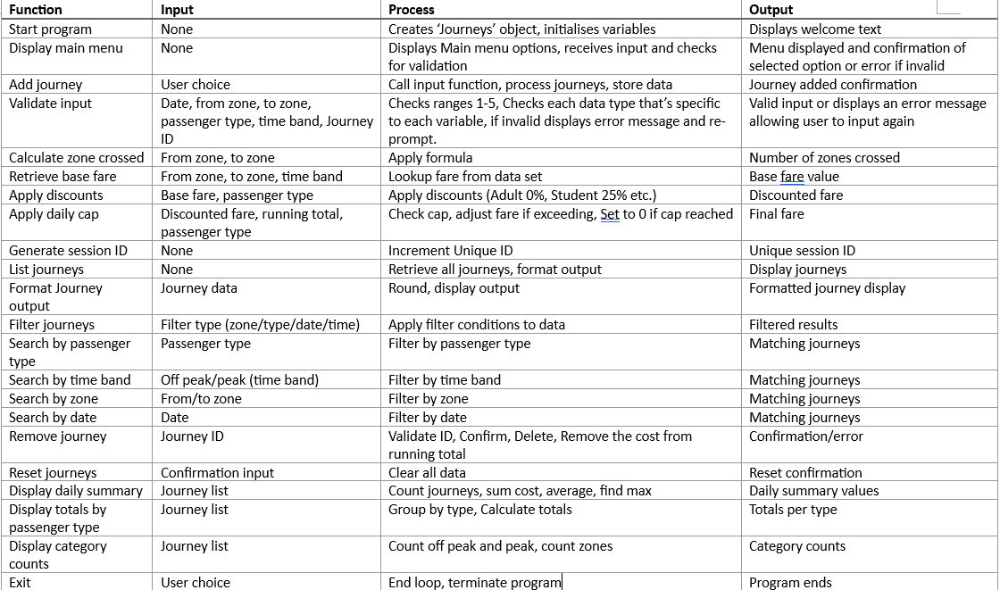

# Introduction

For this project, I was tasked with creating a console-based
application written in Java called CityRide Lite. The application serves to
help users log public transport journeys they have made in a day. The
application allows users to enter journey details including the date, start and
destination zones, the type of passenger and whether the journey was made on
peak or off-peak hours. Using a given dataset, the program will calculate
appropriate fare, apply any discounts applicable to passengers and enforce
daily fare limits. In developing the solution, object-oriented programming
techniques were employed for use within the Java platform. This was achieved
through creating multiple classes responsible for the different tasks such as
journey management, validation of input, fare calculations, generation of daily
summaries and storage of journeys in memory for the session. A number of
functions have been implemented within this solution, these include adding
journeys, viewing saved journeys, sorting journeys according to certain
criteria, deletion of journey details, resetting of the application and daily
summary reports. Validation is incorporated to reject any invalid data, which
might be entered by the user such as incorrect zones and passenger types. The
entire process was carried out systematically, through phases of analysis,
design, implementation, testing, and evaluation. In the analysis phase, the
specifications of the program were determined and decomposed into separate
functions. The flow charts and class diagrams were used for designing the
program. The implementation phase involved creating the program in Java
programming language, where classes, constructor, encapsulation, getters and
setters were some of the concepts used. Testing phase ensured that the designed
solution works effectively as per its specified function. This report
highlights the process of analysis, design, implementation, testing and
evaluation carried out in order to meet the requirements of the assignment.

# Analysis

**Core program functions**

- Ask for journey details

- Take information such as starting zone,
   destination zone, time band and passenger type

- Calculate final fare

- Analyse how many zones crossed, correct base
   fare and apply discounts if applicable and check if daily cap reached
   before calculating

- Memory

- The program must be able to store all the
   journeys entered during that session in the memory so the user may go
   over them at a later time or filter within a certain criteria or remove
   if required

- Journey information

- The application should be able to provide
   summaries like the total journeys, total spend, the average cost and
   their most expensive journey

**System limitations and rules**

**Console UI**: The program is strictly console based

**No persistence**: Records only single
day sessions and calculates everything in its own memory only so no files are
required and only exists during that instance of program

**Zones**: Only 5 zones, central, inner, outer,
suburban, rural

**Time bands**: 2 time bands, Peak and Off peak

**Passenger types**: There are 4 types,
adult, student, senior and child

**Fare rules**: Uses supplied city ride dataset

**Zones crossed formula**: abs(tozone - fromzone) + 1

## IPO Table

# Algorithm Design

## Class Diagram

.png)

## Main

## Add Journey Flowchart

## List Journey Flowchart

## Remove Journeys Flowchart

## Reset Journeys Flowchart

## Daily Summary Flowchart

# Testing

| Test No | Testing item                              | Test Description            | Expected Result                                      | Actual Result                                  | Comments                                      |
|:-------:| ----------------------------------------- | --------------------------- | ---------------------------------------------------- | ---------------------------------------------- | --------------------------------------------- |
| 1       | int choice = input.nextInt();             | Valid data (1)              | System should lead user to Add Journey process       | System leads user to Add Journey process       | No comment                                    |
| 2       | int choice = input.nextInt();             | Extreme data (50)           | System should tell user to pick a valid menu option  | System displays invalid choice message         | No comment                                    |
| 3       | int choice = input.nextInt();             | Invalid data (-50)          | System should tell user to pick a valid menu option  | System displays invalid choice message         | No comment                                    |
| 4       | int choice = input.nextInt();             | Invalid data type ("ABC")   | System should reject input and request integer value | Program terminates with InputMismatchException | Data type validation not implemented          |
| 5       | String date = input.nextLine();           | Valid data (25/05/2026)     | Date should be accepted                              | Date accepted                                  | No comment                                    |
| 6       | String date = input.nextLine();           | Invalid format (2026-05-25) | System should reject date                            | Date accepted                                  | Date format validation not implemented (FAIL) |
| 7       | String date = input.nextLine();           | Blank input ("")            | System should reject date                            | System displays Invalid Date                   | No comment                                    |
| 8       | String date = input.nextLine();           | Invalid value ("ABC")       | System should reject date                            | Date accepted                                  | Date format validation not implemented (FAIL) |
| 9       | int fromZone = input.nextInt();           | Valid data (3)              | Zone should be accepted                              | Zone accepted                                  | No comment                                    |
| 10      | int fromZone = input.nextInt();           | Extreme data (6)            | System should reject zone                            | System displays Invalid Zone                   | No comment                                    |
| 11      | int fromZone = input.nextInt();           | Invalid data (-1)           | System should reject zone                            | System displays Invalid Zone                   | No comment                                    |
| 12      | int fromZone = input.nextInt();           | Invalid data type ("ABC")   | System should reject input and request integer value | Program terminates with InputMismatchException | Data type validation not implemented (FAIL)   |
| 13      | int toZone = input.nextInt();             | Valid data (5)              | Zone should be accepted                              | Zone accepted                                  | No comment                                    |
| 14      | int toZone = input.nextInt();             | Extreme data (10)           | System should reject zone                            | System displays Invalid Zone                   | No comment                                    |
| 15      | int toZone = input.nextInt();             | Invalid data (-1)           | System should reject zone                            | System displays Invalid Zone                   | No comment                                    |
| 16      | int toZone = input.nextInt();             | Invalid data type ("ABC")   | System should reject input and request integer value | Program terminates with InputMismatchException | Data type validation not implemented (FAIL)   |
| 17      | String passengerInput = input.nextLine(); | Valid data (ADULT)          | Passenger type should be accepted                    | Passenger type accepted                        | No comment                                    |
| 18      | String passengerInput = input.nextLine(); | Invalid value (TEACHER)     | System should reject passenger type                  | System displays Invalid Passenger Type         | No comment                                    |
| 19      | String passengerInput = input.nextLine(); | Blank input ("")            | System should reject passenger type                  | System displays Invalid Passenger Type         | No comment                                    |
| 20      | String passengerInput = input.nextLine(); | Invalid format (adult123)   | System should reject passenger type                  | System displays Invalid Passenger Type         | No comment                                    |
| 21      | String timeBandInput = input.nextLine();  | Valid data (PEAK)           | Time band should be accepted                         | Time band accepted                             | No comment                                    |
| 22      | String timeBandInput = input.nextLine();  | Invalid value (MIDDAY)      | System should reject time band                       | System displays Invalid Time Band              | No comment                                    |
| 23      | String timeBandInput = input.nextLine();  | Blank input ("")            | System should reject time band                       | System displays Invalid Time Band              | No comment                                    |
| 24      | String timeBandInput = input.nextLine();  | Invalid format (peak123)    | System should reject time band                       | System displays Invalid Time Band              | No comment                                    |
| 25      | int choice = input.nextInt();             | Valid data (1)              | System should display all journeys                   | Journeys displayed                             | No comment                                    |
| 26      | int choice = input.nextInt();             | Extreme data (50)           | System should display invalid choice message         | System displays invalid choice message         | No comment                                    |
| 27      | int choice = input.nextInt();             | Invalid data (-50)          | System should display invalid choice message         | System displays invalid choice message         | No comment                                    |
| 28      | int choice = input.nextInt();             | Invalid data type ("ABC")   | System should reject input and request integer value | Program terminates with InputMismatchException | Data type validation not implemented (FAIL)   |
| 29      | String filter = input.nextLine();         | Valid data (STUDENT)        | Matching journeys should be displayed                | Matching journeys displayed                    | No comment                                    |
| 30      | String filter = input.nextLine();         | Invalid value (VIP)         | No matching journeys should be found                 | No matching journeys found                     | No comment                                    |
| 31      | String filter = input.nextLine();         | Blank input ("")            | No matching journeys should be found                 | No matching journeys found                     | No comment                                    |
| 32      | String filter = input.nextLine();         | Invalid format (student123) | No matching journeys should be found                 | No matching journeys found                     | No comment                                    |
| 33      | String filter = input.nextLine();         | Valid data (PEAK)           | Matching journeys should be displayed                | Matching journeys displayed                    | No comment                                    |
| 34      | String filter = input.nextLine();         | Invalid value (MORNING)     | No matching journeys should be found                 | No matching journeys found                     | No comment                                    |
| 35      | String filter = input.nextLine();         | Blank input ("")            | No matching journeys should be found                 | No matching journeys found                     | No comment                                    |
| 36      | String filter = input.nextLine();         | Invalid format (peak123)    | No matching journeys should be found                 | No matching journeys found                     | No comment                                    |
| 37      | int zone = input.nextInt();               | Valid data (3)              | Matching journeys should be displayed                | Matching journeys displayed                    | No comment                                    |
| 38      | int zone = input.nextInt();               | Extreme data (10)           | No matching journeys should be found                 | No matching journeys found                     | No comment                                    |
| 39      | int zone = input.nextInt();               | Invalid data (-1)           | No matching journeys should be found                 | No matching journeys found                     | No comment                                    |
| 40      | int zone = input.nextInt();               | Invalid data type ("ABC")   | System should reject input and request integer value | Program terminates with InputMismatchException | Data type validation not implemented (FAIL)   |
| 41      | String date = input.nextLine();           | Valid data (25/05/2026)     | Matching journeys should be displayed                | Matching journeys displayed                    | No comment                                    |
| 42      | String date = input.nextLine();           | Invalid format (2026-05-25) | No matching journeys should be found                 | No matching journeys found                     | No comment                                    |
| 43      | String date = input.nextLine();           | Blank input ("")            | No matching journeys should be found                 | No matching journeys found                     | No comment                                    |
| 44      | String date = input.nextLine();           | Invalid value ("ABC")       | No matching journeys should be found                 | No matching journeys found                     | No comment                                    |
| 45      | int id = input.nextInt();                 | Valid data (Existing ID 1)  | Journey should be removed                            | Journey removed successfully                   | No comment                                    |
| 46      | int id = input.nextInt();                 | Extreme data (999)          | System should indicate journey not found             | System indicates journey not found             | No comment                                    |
| 47      | int id = input.nextInt();                 | Invalid data (-1)           | System should indicate journey not found             | System indicates journey not found             | No comment                                    |
| 48      | int id = input.nextInt();                 | Invalid data type ("ABC")   | System should reject input and request integer value | Program terminates with InputMismatchException | Data type validation not implemented (FAIL)   |

# Evaluation

In general, this CityRide Lite program fulfills the majority of the requirements defined in the assignment description. Users can make new journeys, calculate the fare based on the provided database, give discounts for passengers, set daily fare caps, view the list of added journeys, filter journeys according to specified criteria, delete journeys, reset the session, and create summary reports. The program uses object-oriented programming in the development process with various classes used to implement certain functions of the program.

Nevertheless, there are still certain areas in which improvements can be made. According to the sheet, all invalid user input must be processed and re-entered until the proper value is entered. Invalid user values usually lead to the appearance of an error message followed by the transition to the main menu. Besides that, at the moment, the program cannot cope with handling exceptions in the form of the InputMismatchException error. For example, when the user enters text instead of an integer number, the application terminates unexpectedly.

## Strengths

1. Proper use of OOP

One significant strength of the program is the implementation of OOP principle. Responsibility for different tasks in the program has been distributed among various classes such as Journey, JourneyManager, FareCalculator, Validation and SummaryManager. This increases the comprehensibility and scalability of the program.

2. Efficient use of dataset

The dataset provided as part of the assignment has been incorporated effectively in the program. The calculation of fares, discount to passengers, zone validation and fare cap for each day are carried out based on the data available in the dataset rather than being hard-coded in the program code.

3. Comprehensive functionality

Various functionalities provided in the application include add journey, view journey, filter by passenger type, time band, zone and date, generate summaries and delete journey. All these functionalities provide the comprehensive application specified in the requirements.

## Weaknesses

1. Lack of exception handling for invalid data types

The main shortcoming of the code is the absence of exception handling for invalid data types. When trying to enter any text like "toy" where an integer is supposed to be entered, the application terminates due to the InputMismatchException. This error affect the seamless work of the application.

2. Poor date validation

Date validation is currently performed on the absence of any inputs. Therefore, even invalid strings like "jay" might be used in the application without any restrictions. It can lead to poor quality data storage.

3. No prompting users to re-enter data

According to the task sheet, an application should prompt users to re-enter data after receiving invalid ones. However, the current version prompts the user to go back to a menu and re-enter their choice if some input was incorrect. While it is good because it excludes any wrong values, to be honest, I don't believe it properly completes the task.

## Areas for Improvement

1. Exception handling

The program can be modified to incorporate more try-catch statements surrounding scanner input operations. The program will avoid any possible crash in case of invalid data type being provided by the user and permit the users to proceed with using the software after providing invalid input data. This improvement will greatly enhance the level of reliability and professionalism of the program.

2. Enhanced input validation

The validation mechanism can be improved to include date format validation and ask for correct input several times until valid input is provided. The improved validation will lead to higher-quality data input and will make the software usage more convenient.

## Conclusion

The final version of the program meets the main purpose of creating a program which serves as a companion app that can be used for storing information on public transport travels. All the main requirements have been fulfilled, and the program shows good structure and efficient implementation of OOP techniques. There are some minor issues concerning input validation and exception handling; however, the solution is generally satisfactory.

# Code Listing

### Main

import java.util.Scanner;  

public class Main {  
    static Scanner input = new Scanner(System.in);  
    static JourneyManager manager = new JourneyManager(input);  
    public static void main(String[] args) {  

int choice;  
do {  

    displayMenu();  
    choice = getUserChoice();  
    
    switch (choice) {  
    
        <mark>// (Bro Code, 2024) </mark> 
    
        <mark>case 1:</mark>  
            manager.addJourney();  
            break;  
    
        <mark>case 2</mark>:  
            manager.viewJourneysMenu();  
            break;  
        <mark>case 3:</mark>  
            manager.viewDailySummary();  
            break;  
    
        <mark>case 4</mark>:  
            manager.removeJourney();  
            break;  
    
        <mark>case 5: </mark> 
            manager.resetJourneys();  
            break;  
    
        <mark>case 6:</mark>  
            System.out.println("Program closed");  
            break;  
    
      <mark>  default</mark>:  
            System.out.println("\nInvalid choice");  
    
    }  

} while (choice != 6);  

}  
public static void displayMenu() {  

System.out.println("CityRide Lite\n");  

System.out.println("1. Add Journey");  
System.out.println("2. View Journeys");  
System.out.println("3. Daily summary");  
System.out.println("4. Remove Journey");  
System.out.println("5. Reset Day");  
System.out.println("6. Exit");  

}  
public static int getUserChoice() {  

System.out.print("Enter Choice: ");  
int choice = input.nextInt();  
input.nextLine();  

return choice;  

}  

}

## Journey

import java.math.BigDecimal;  

public class Journey {  
    private int journeyID;  
    private String date;  
    private int fromZone;  
    private int toZone;  
    private CityRideDataset.PassengerType passengerType;  
    private CityRideDataset.TimeBand timeBand;  
    private BigDecimal baseFare;  
    private BigDecimal finalFare;  

// Constructor  
public Journey(int journeyID, String date, int fromZone, int toZone, CityRideDataset.PassengerType passengerType,  
               CityRideDataset.TimeBand timeBand, BigDecimal baseFare, BigDecimal finalFare)  
{  

this.journeyID = journeyID;  
this.date = date;  
this.fromZone = fromZone;  
this.toZone = toZone;  
this.passengerType = passengerType;  
this.timeBand = timeBand;  
this.baseFare = baseFare;  
this.finalFare = finalFare;  

}  

// Get methods  
public int getJourneyID() {  
    return journeyID;  
}  
public String getDate() {  
    return date;  
}  
public int getFromZone() {  
    return fromZone;  
}  
public int getToZone() {  
    return toZone;  
}  
public CityRideDataset.PassengerType getPassengerType() {  
    return passengerType;  
}  
public CityRideDataset.TimeBand getTimeBand() {  
    return timeBand;  
}  
public BigDecimal getBaseFare() {  
    return baseFare;  
}  
public BigDecimal getFinalFare() {  
    return finalFare;  
}  

// Set methods  
public void setJourneyID(int journeyID) {  
    this.journeyID = journeyID;  
}  
public void setDate(String date) {  
    this.date = date;  
}  
public void setFromZone(int fromZone) {  
    this.fromZone = fromZone;  
}  
public void setToZone(int toZone) {  
    this.toZone = toZone;  
}  
public void setPassengerType(CityRideDataset.PassengerType passengerType) {  
    this.passengerType = passengerType;  
}  
public void setTimeBand(CityRideDataset.TimeBand timeBand) {  
    this.timeBand = timeBand;  
}  
public void setBaseFare(BigDecimal baseFare) {  
    this.baseFare = baseFare;  
}  
public void setFinalFare(BigDecimal finalFare) {  
    this.finalFare = finalFare;  
}  

// Methods  
public int calculateZonesCrossed() {  
    return Math.abs(fromZone - toZone) + 1;  

}  
public void displayJourney() {  
    System.out.println("\nJourney ID: " + journeyID);  
    System.out.println("Date: " + date);  
    System.out.println("From Zone: " + fromZone);  
    System.out.println("To Zone: " + toZone);  
    System.out.println("Passenger Type: " + passengerType);  
    System.out.println("Time Band: " + timeBand);  
    System.out.println("Base Fare: " + baseFare);  
    System.out.println("Final Fare: " + finalFare);  
}  

}

## Journey Manager

import java.util.ArrayList;  
import java.util.Scanner;  
import java.math.BigDecimal;  

public class JourneyManager{  

private ArrayList<Journey> journeys;  
private Scanner input;  
private Validation validation;  
private FareCalculator calculator;  
private SummaryManager summaryManager;  
private int nextJourneyID;  

// Constructor  
public JourneyManager(Scanner input) {  

journeys = new ArrayList<>();  
validation = new Validation();  
this.input = input;  
calculator = new FareCalculator();  
summaryManager = new SummaryManager();  
nextJourneyID = 1;  

}  

public void addJourney() {  
    System.out.println("\nAdd Journey");  

// Date  
System.out.print("Enter Date: ");  
String date = input.nextLine();  

// Validate Date  
if (!validation.validateDate(date)) {  

    System.out.println("Invalid Date");  
    
    return;  

}  

// Zones  
System.out.print("Enter From Zone: ");  
int fromZone = input.nextInt();  

System.out.print("Enter To Zone: ");  
int toZone = input.nextInt();  

// Validate Zones  
if (!validation.validateZone(fromZone) || !validation.validateZone(toZone)) {  

    System.out.println("Invalid Zone");  
    
    return;  

}  

input.nextLine();  

// Passenger Type  
System.out.print("Passenger Type (ADULT/STUDENT/CHILD/SENIOR_CITIZEN): ");  

String passengerInput =  
        input.nextLine().toUpperCase();  

// Validate Passenger Type  
if (!validation.validatePassengerType(passengerInput)) {  

    System.out.println("Invalid Passenger Type");  
    
    return;  

}  
// Time Band  
System.out.print(  
        "Time Band (PEAK/OFF_PEAK): "  
);  

String bandInput =  
        input.nextLine().toUpperCase();  

// Validate Time Band  
if (!validation.validateTimeBand(bandInput)) {

System.out.println("Invalid Time Band"); 

return;  

}  

// Convert To Enums  

   <mark> // (Oracle, 2026)</mark>

CityRideDataset.PassengerType passengerType = <mark>CityRideDataset.PassengerType.valueOf(passengerInput);</mark>  
    CityRideDataset.TimeBand timeBand = <mark>CityRideDataset.TimeBand.valueOf(bandInput); </mark> 

// Fare  
BigDecimal baseFare = calculator.calculateBaseFare(fromZone, toZone, timeBand);  
BigDecimal finalFare = calculator.applyDiscount(baseFare, passengerType);  

// Daily cap  
BigDecimal totalSpentToday = BigDecimal.ZERO;  

for (Journey existingJourney : journeys) {  
    if (existingJourney.getDate().equals(date) && existingJourney.getPassengerType() == passengerType) {  

        <mark>// (In28Minutes, 2018)</mark>  
        <mark>totalSpentToday = totalSpentToday.add(existingJourney.getFinalFare()); </mark> 

</mark>
        }  
    }  
    finalFare = calculator.applyDailyCap(totalSpentToday, finalFare, passengerType);

// Create Journey  
Journey journey = new Journey(nextJourneyID, date, fromZone, toZone, passengerType, timeBand, baseFare, finalFare);  
// Store Journey  

   <mark> // (Oracle, 2026)  </mark>    

 <mark> journeys.add(journey)</mark>;  

nextJourneyID++;  

System.out.println("\nJourney Added Successfully");  

}  

public void listJourneys() {  
    if (journeys.isEmpty()) {  
        System.out.println("\nNo Journeys Stored");  

    return;  

}  

for (Journey journey : journeys) {  
    journey.displayJourney();  
}  

}  

public void filterByPassengerType() {  
    input.nextLine();  
    System.out.print("\nEnter Passenger Type To Filter: ");  

String filter = input.nextLine().toUpperCase();  

boolean found = false;  

for (Journey journey : journeys) {  

   <mark> // (Alexandra Obregon, 2024)</mark>  
    if <mark>(journey.getPassengerType().name().equals(filter)) {journey.displayJourney()</mark>;  

        found = true;  
    }  

}  
if (!found) {  

    System.out.println(  
            "\nNo Matching Journeys Found"  
    );  

}  

}  

public void filterByTimeBand() {  

input.nextLine();  
System.out.print("\nEnter Time Band (PEAK/OFF_PEAK): ");  

String filter = input.nextLine().toUpperCase();  

boolean found = false;  

for (Journey journey : journeys) {  

    if (journey.getTimeBand().name().equals(filter)) {  
        journey.displayJourney();  
        found = true;  
    }  

}  
if (!found) {  

    System.out.println("\nNo Matching Journeys Found");  

}  

}  

public void filterByZone() {  

System.out.print("\nEnter Zone: ");  
int zone = input.nextInt();  
boolean found = false;  

for (Journey journey : journeys) {  

    if (journey.getFromZone() == zone || journey.getToZone() == zone) {  
        journey.displayJourney();  
        found = true;  
    }  

}  

if (!found) {  
    System.out.println("\nNo Matching Journeys Found");  
}  

}  

public void filterByDate() {  

input.nextLine();  
System.out.print("\nEnter Date: ");  
String date = input.nextLine();  
boolean found = false;  

for (Journey journey : journeys) {  
    if (journey.getDate().equals(date)) {  

        journey.displayJourney();  
        found = true;  
    }  

}  

if (!found) {  
    System.out.println("\nNo Matching Journeys Found");  
}  

}  

public void removeJourney() {  
    System.out.print("\nEnter Journey ID To Remove: ");  

int id = input.nextInt();  

boolean removed = false;  

for (int i = 0; i < journeys.size(); i++) {  

    if (journeys.get(i).getJourneyID() == id) {  
    
        journeys.remove(i);  
    
        removed = true;  
    
        System.out.println("\nJourney Removed");  
    
        break;  
    
    }  

}  

if (!removed) {  

    System.out.println("\nJourney ID Not Found");  

}  

}  

public void resetJourneys() {  
    journeys.clear();  

System.out.println("\nAll Journeys Reset");  

}  

public void viewDailySummary() {  

summaryManager.calculateDailySummary(journeys);  

}  

public void viewJourneysMenu() {  

int choice;  

do {  

    System.out.println("\nView Journeys");  
    
    System.out.println("1. View All Journeys");  
    
    System.out.println("2. Filter By Passenger Type");  
    
    System.out.println("3. Filter By Time Band");  
    
    System.out.println("4. Filter By Zone");  
    
    System.out.println("5. Filter By Date");  
    
    System.out.println("6. Passenger Totals");  
    
    System.out.println("7. Journey categories");  
    
    System.out.println("8. Return");  
    
    System.out.print("Enter Choice: ");  
    
    choice = input.nextInt();  

  <mark>  // (Bro Code, 2024) </mark> 

    switch (choice) {  
    
       <mark> case 1</mark>:  
            listJourneys();  
            break;  
    
        <mark>case 2: </mark> 
            filterByPassengerType();  
            break;  
    
        <mark>case 3:</mark>  
            filterByTimeBand();  
            break;  
    
       <mark> case 4: </mark> 
            filterByZone();  
            break;  
    
        <mark>case 5: </mark> 
            filterByDate();  
            break;  
    
        <mark>case 6</mark>:  
            summaryManager.calculateTotalsByPassengerType(journeys);  
            break;  
    
        <mark>case 7:</mark>  
            summaryManager.countJourneyCategories(journeys);  
            break;  
    
    }  

} while (choice != 8);  

}  

}

## Fare Calculator

import java.math.BigDecimal;  
import java.math.RoundingMode;  

public class FareCalculator {  

// Constructor  
public FareCalculator() {}  

// Calculate Base Fare  
// (In28Minutes, 2018)    public BigDecimal calculateBaseFare(int fromZone, int toZone, CityRideDataset.TimeBand timeBand) {  

return CityRideDataset.getBaseFare(fromZone, toZone, timeBand);  

}  

// Apply Discount  
<mark>// (In28Minutes, 2018) </mark>   public BigDecimal applyDiscount(BigDecimal baseFare, CityRideDataset.PassengerType passengerType) {  

BigDecimal discountRate = CityRideDataset.DISCOUNT_RATE.get(passengerType);  
BigDecimal discount = <mark>baseFare.multiply(discountRate)</mark>;  
BigDecimal finalFare =<mark> baseFare.subtract(discount);</mark>  

<mark>// (Oracle, 2026)  </mark>

   <mark> return finalFare.setScale(2, RoundingMode.HALF_UP </mark> 
    );  
}  

public BigDecimal applyDailyCap(BigDecimal totalSpentToday, BigDecimal currentFare,  
        CityRideDataset.PassengerType passengerType) {  

BigDecimal cap = CityRideDataset.DAILY_CAP.get(passengerType);  

<mark>// (Oracle, 2026)</mark>  

   <mark> BigDecimal newTotal = totalSpentToday.add(currentFare);  
</mark>
    if (newTotal.compareTo(cap) > 0) {  

   <mark> // (In28Minutes, 2018) </mark> 
    <mark>BigDecimal remaining = cap.subtract(totalSpentToday);</mark>  

 <mark>   if (remaining.compareTo(BigDecimal.ZERO) < 0) {  

</mark>
           <mark> return BigDecimal.ZERO;  
</mark>
        }

    return remaining;  

}  
return currentFare;  

}  

}

## Validation

public class Validation{  
    public Validation() {  
    }  
    // Validate Zone  
    public boolean validateZone(int zone) {  

return zone >= CityRideDataset.MIN_ZONE && zone <= CityRideDataset.MAX_ZONE;  

}  

<mark>// Validate Passenger Type</mark>  
<mark>// (Bro Code, 2024) </mark>   public boolean validatePassengerType(  
        String type  
) {  
   <mark> try </mark>{  
        CityRideDataset.PassengerType.valueOf(type);  
        return true;  

}  

   <mark> catch </mark>(IllegalArgumentException e) {  
        return false;  

}  

}  

// Validate Time Band  
<mark>// (Bro Code, 2024)</mark>    public boolean validateTimeBand(  
        String band  
) {  
   <mark> try {</mark>  
        CityRideDataset.TimeBand.valueOf(band);  
        return true;  
    }  

<mark>catch </mark>(IllegalArgumentException e) {  
    return false;  
}  

}  

// Validate Date  
public boolean validateDate(String date) {  
    return !date.isBlank();  

}  

}

## Summary Manager

import java.util.ArrayList;  
import java.math.BigDecimal;  
import java.math.RoundingMode;  

public class SummaryManager{  
    // Constructor  
    public SummaryManager() {}  

// Daily Summary  
public void calculateDailySummary(ArrayList<Journey> journeys) {  

if (journeys.isEmpty()) {  
    System.out.println("\nNo Journeys Stored");  
    return;  

}  

BigDecimal totalCharged =  
        BigDecimal.ZERO;  

Journey mostExpensive =  
        journeys.get(0);  

for (Journey journey : journeys) {  
    totalCharged = totalCharged.add(journey.getFinalFare());  

    if (journey.getFinalFare().compareTo(mostExpensive.getFinalFare()) > 0) {  
        mostExpensive = journey;  
    
    }  

}  

   <mark> // (In28Minutes, 2018)  </mark>

BigDecimal averageFare = totalCharged.divide(BigDecimal.valueOf(journeys.size()), 2, <mark>RoundingMode.HALF_UP);</mark>  

System.out.println(  
        "Daily Summary\n"  
);  

System.out.println("Total Journeys: " + journeys.size());  

System.out.println("Total Charged: " + totalCharged);  

System.out.println("Average Fare: " + averageFare);  

System.out.println("Most Expensive Journey ID: " + mostExpensive.getJourneyID());  

System.out.println("Most Expensive Fare:" + mostExpensive.getFinalFare());  

}  

// Passenger Totals  
public void calculateTotalsByPassengerType(ArrayList<Journey> journeys) {  

int adults = 0;  
int students = 0;  
int children = 0;  
int seniors = 0;  

for (Journey journey : journeys) {  

    switch (journey.getPassengerType()) {  
        case ADULT:  
            adults++;  
            break;  
    
        case STUDENT:  
            students++;  
            break;  
    
        case CHILD:  
            children++;  
            break;  
    
        case SENIOR_CITIZEN:  
            seniors++;  
            break;  
    
    }  

}  

System.out.println(  
        "Passenger Totals\n"  
);  

System.out.println("Adults: " + adults);  

System.out.println("Students: " + students);  

System.out.println("Children: " + children);  

System.out.println("Senior Citizens: " + seniors);  

}  

// Journey Categories  
public void countJourneyCategories(ArrayList<Journey> journeys) {  

int peak = 0;  
int offPeak = 0;  

for (Journey journey : journeys) {  

    if (journey.getTimeBand() == CityRideDataset.TimeBand.PEAK) {  
        peak++;  
    }  
    
    else {  
        offPeak++;  
    }  

}  

System.out.println("Journey Categories\n");  
System.out.println("Peak Journeys: " + peak);  
System.out.println("Off Peak Journeys: " + offPeak);  

}  

}

# References

- Oracle. (2014). *List (Java Platform SE 8)*. Retrieved from: [List (Java Platform SE 8 )](https://docs.oracle.com/javase/8/docs/api/java/util/List.html) [Accessed 31 May 2026].

- Oracle. (2014). *Enum (Java Platform SE 8)*. Retrieved from: [Enum (Java Platform SE 8 )](https://docs.oracle.com/javase/8/docs/api/java/lang/Enum.html) [Accessed 31 May 2026].

- Bro Code. (2024, December 9). *Learn EXCEPTION HANDLING in 8 minutes! ⚠️*. [YouTube video]. Retrieved from: [Learn EXCEPTION HANDLING in 8 minutes! ⚠️ - YouTube](https://www.youtube.com/watch?v=u1PROb-aRUI) [Accessed 22 May 2026].

- In28Minutes (2018, March 20). *Java BigDecimal Tutorial - 1*. [YouTube video]. Retrieved from: [Java BigDecimal Tutorial - 1 - YouTube](https://www.youtube.com/watch?v=MK6LDyQuv6U) [Accessed 23 May 2026].

- Oracle. (2014). *RoundingMode (Java Platform SE 8)*. Retrieved from: [RoundingMode (Java Platform SE 8 )](https://docs.oracle.com/javase/8/docs/api/java/math/RoundingMode.html) [Accessed 23 May 2026].

- Bro Code. (2024, December 5). *Learn Java enhanced switches in 8 minutes! 💡*. [YouTube video]. Retrieved from: [Learn Java enhanced switches in 8 minutes! 💡 - YouTube](https://www.youtube.com/watch?v=6q2JKiynteM&t=75s) [Accessed 18 May 2026].

- Obregon, A. (2024, September 1). Java's Objects.equals() Method Explained, *Medium*. [online] Retrieved from: https://medium.com/@AlexanderObregon/javas-objects-equals-method-explained-3a84c963edfa [Accessed 23 May 2026].

- Vertex42. (n.d.). *Simple Gantt Chart*. Retrieved from: [Simple Gantt Chart by Vertex42](https://www.vertex42.com/ExcelTemplates/simple-gantt-chart.html) [Accessed 02 May 2026].

# <mark>Appendices</mark>

- Obregon, A. (2024, September 1). Java's Objects.equals() Method Explained, *Medium*. [online] Retrieved from: https://medium.com/@AlexanderObregon/javas-objects-equals-method-explained-3a84c963edfa [Accessed 23 May 2026].
