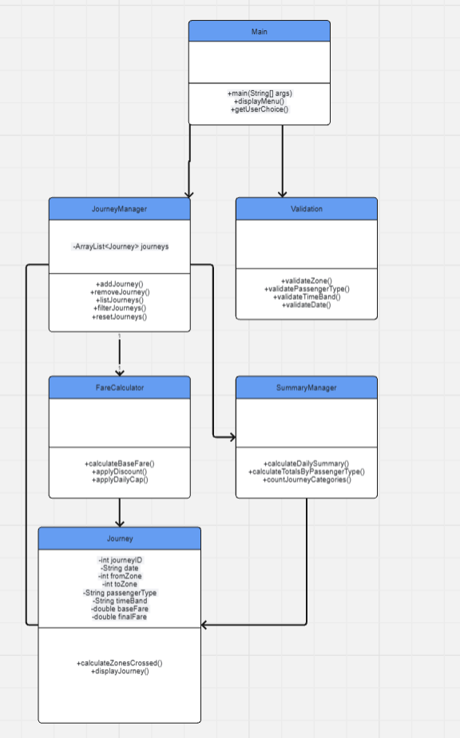
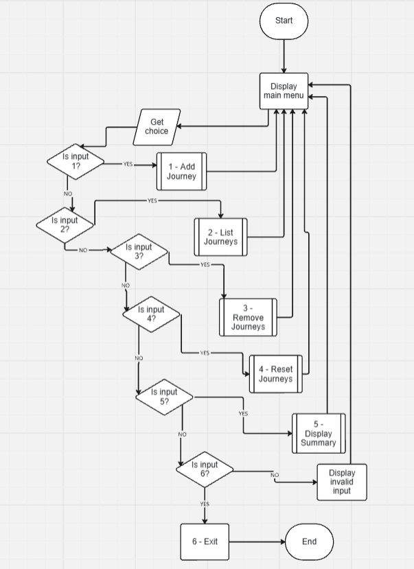
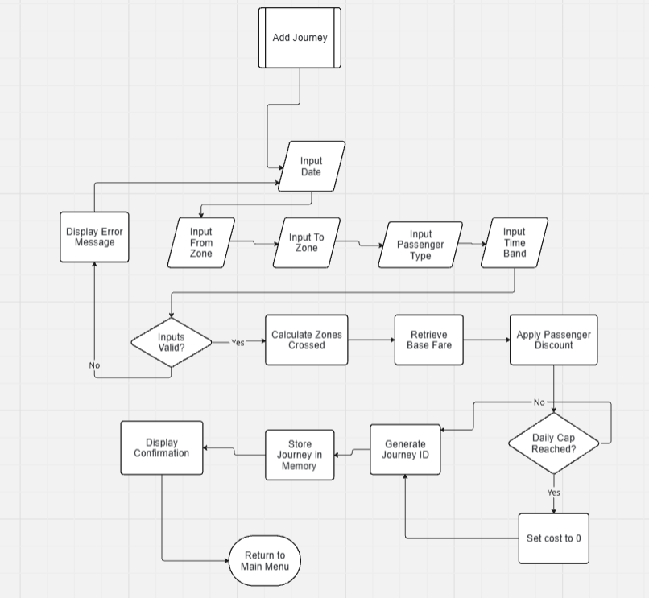
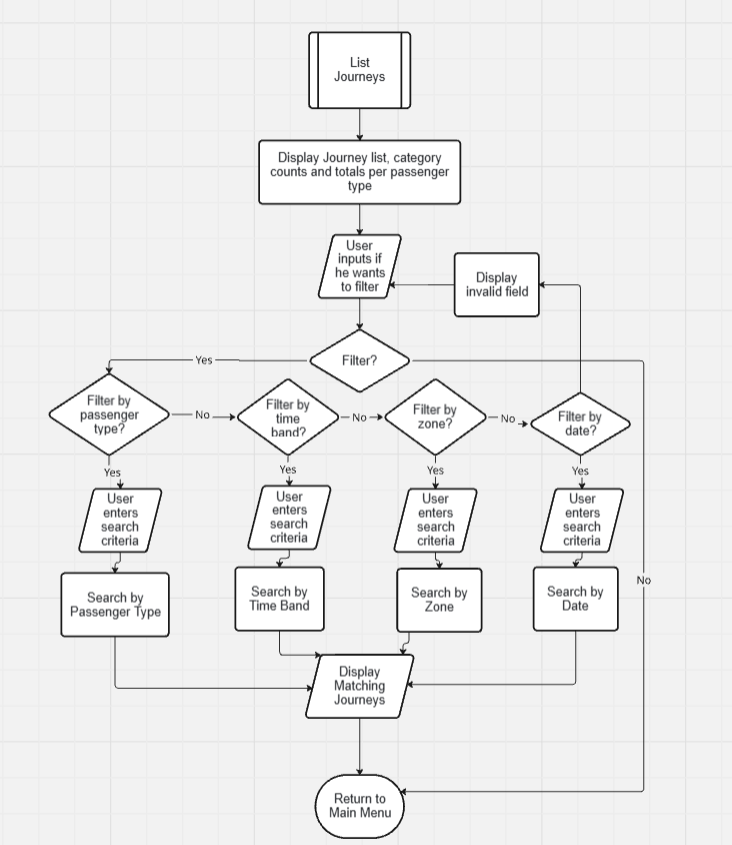
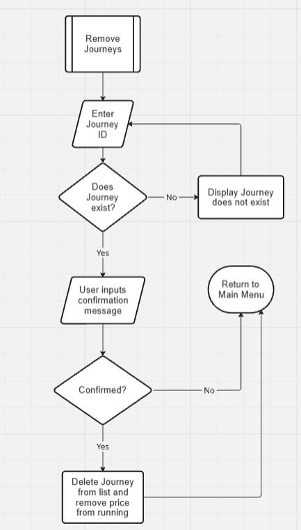
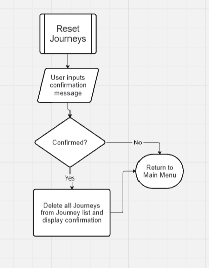
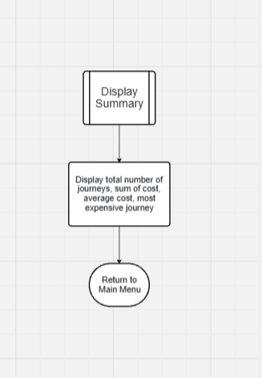
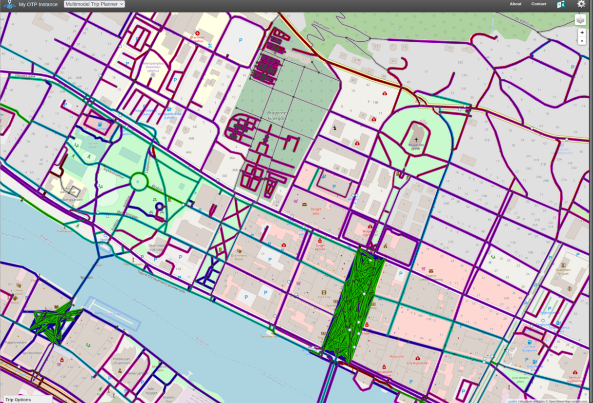
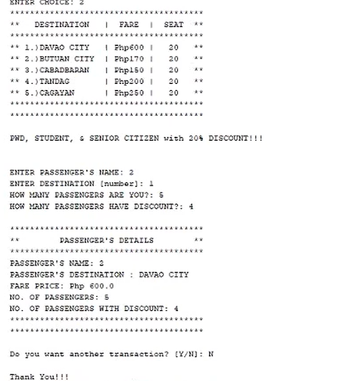

# IY4113 Milestone 2

| Assessment Details | Please Complete All Details                                      |
| ------------------ | ---------------------------------------------------------------- |
| Group              | A                                                                |
| Module Title       | Applied Software Engineering using Object Orientated Programming |
| Assessment Type    | Java Fundamentals part 1                                         |
| Module Tutor Name  | Jonathon Shore                                                   |
| Student ID Number  | P495305                                                          |
| Date of Submission | 10/ 05/2026                                                      |
| Word Count         | 938                                                              |

- [x] *I confirm that this assignment is my own work. Where I have referred to academic sources, I have provided in-text citations and included the sources in
  the final reference list.*
- [x] *Where I have used AI, I have cited and referenced appropriately.

------------------------------------------------------------------------------------------------------------------------------

### Algorithm Design

------------------------------------------------------------------------------------------------------------------------------

##### Class Diagram

##### Main Flowchart

##### Add Journey Flowchart

##### List Journey Flowchart

##### Remove Journey Flowchart

##### Reset Journeys Flowchart

##### Display summary Flowchart

------------------------------------------------------------------------------------------------------------------------------

### Research

------------------------------------------------------------------------------------------------------------------------------

#### Name of the program: OpenTripPlanner

Reference: [opentripplanner/OpenTripPlanner: An open source multi-modal trip planner](https://github.com/opentripplanner/OpenTripPlanner)

What it does well:

- It's able to efficiently organise the journey and transport data making it fast

- The code uses seperated components showing functional decomposition

- Provides journey planning capabilities

What it does poorly:

- Some of their features are heavily rely on external datasets and API's making it harder for beginners to run

Key design ideas I plan on re-using include:

- The seperation of logic into different modules

- The clean flow of data handling

Screenshot: 

#### Name of the program: Bus Reservation System

Reference: [Bus Reservation and Ticketing System In JAVA With Source Code - Source Code & Projects](https://code-projects.org/bus-reservation-and-ticketing-system-in-java-with-source-code/)

What it does well: 

- The console structure is menu based so it runs indefinetly till user decides to quit.

- Billing and fare calculations are carried out very efficiently

- Stores both the journey and the passenger information

What it does poorly:

- The interface is incredibly basic

- Back-end can be made better as the program has to ask you how many passengers have a discount rather than than the program checking and applying it itself

Key ideas I plan on re-using:

- The menu based structure

- The efficient fare calculations

- Storing more variables of the journey to allow narrower filtering 

Screenshot:

------------------------------------------------------------------------------------------------------------------------------

### Updated Gantt Chart

---

------------------------------------------------------------------------------------------------------------------------------

### Diary Entries

---

#### Diary Entry 1 - 05/05/2026

Today I kickstarted this milestone, I began by reading the template and reading the assessment sheet and realised I was in for a big one, multiple flowcharts was a huge step up from what I normally draw for algorithm design, nevertheless I started, I began by drawing the main flowchart pertaining to the beginning of the code this flowchart was quit simple to be honest, just a simple menu with a loop to keep it running till the user decides to quit with a validation system, nothing too bad. I then started the sub proccesses, the add journey flowchart was a bit long I went through multiple versions of this flowchart changing whether the program would validate the input after every input or after all inputs are taken in, in the end I settled for the latter for simplicity's sake and called it a day.

#### Diary Entry 2 - 06/05/2026

Today I made it a goal to finish the algorithm design section so I can have a move on and start working on the other sections, the filter journeys flowchart was another long one aswell due to the fact that I had to handle a lot of options the user can choose, the different types of filtering and potentially the total counts of the different categories and totals of passenger types, in the end I made it easy and just decided to include it at the start of the function to just display those statistics and further filtering is a choice. After completing that the other flowcharts were very simple and short so after that I thought I was finished, but after reading the template I realised I also had to make a class diagram so spent 2 hours more just working on that and finally finished.

#### Diary Entry 3 - 07/05/2026

Today I started the research section, I began by scouring github in search of code that was similar to what i was planning to achieve, I searched for nearly 3 hours and with alot of potential codes I wasn't able to run 90% of them, There was always some issue or another preventing me from properly running and understanding the code, in the end I found 1 github code then I turned to good old google to search for other open source programs that are similar, after a few minutes I found one, I analysed both of them, the front end and the back end and learned a few things, and made my comments in this file and finished, this section took me 2 days due to lengthy search.

#### Diary Entry 4 - 09/05/2026

Today was the final and easiest day, I had one section left, update the gantt chart. I referred back to these entries checked all the dates and just added them to the chart, after that all that was left was to add the screenshots of the flowchart and class diagram from Miro and upload the gantt chart, I fixed some of the formatting and referred back to my first milestone constantly checking back and forth to keep as similar as a format as possible and just proof read my entries a few times and finished.
